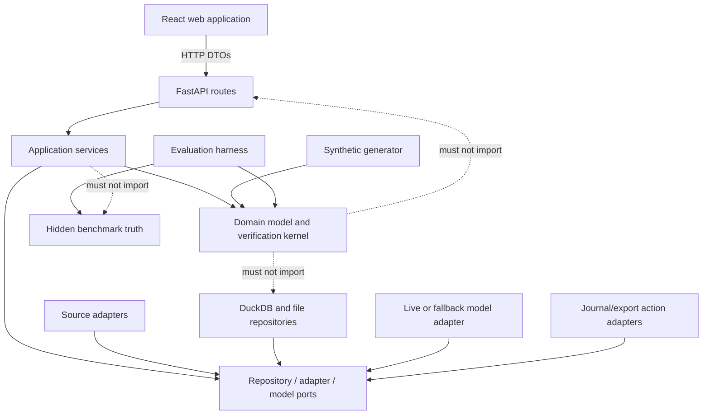
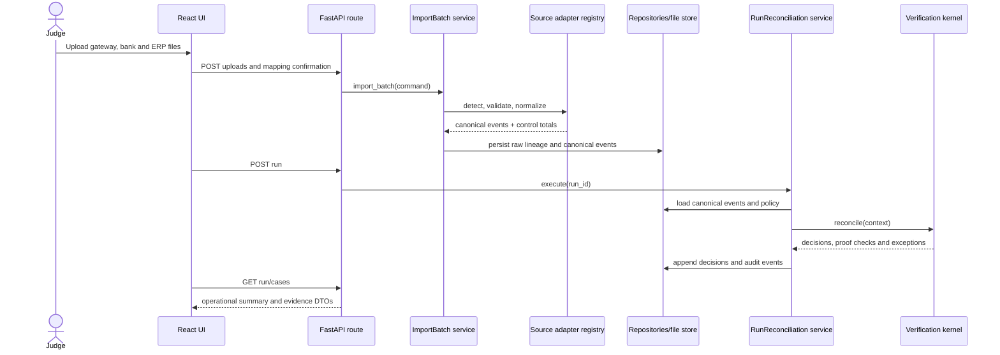
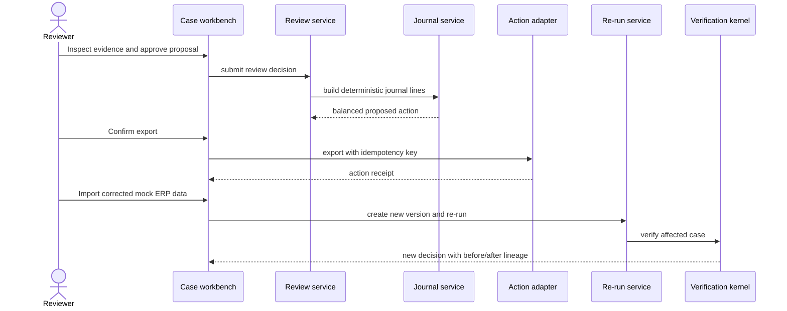

# VeriClose Ground-Up Build and Assembly Guide

## Purpose

`PROJECT_PLAN.md` explains what and why. `TASKS.md` is the acceptance-controlled backlog. This file explains **how to build the system, where each piece belongs, how pieces communicate, and how to assemble them without creating a tangled application**.

Use this guide while coding. Each implementation step points back to task segments and ends with a stop check. Do not continue past a failed stop check.

## The architecture in one sentence

> Source adapters convert untrusted files into immutable canonical finance events; a deterministic verification kernel produces evidence-backed decisions; application services persist and expose those decisions; a bounded AI investigator adds advisory explanations; reviewers approve typed actions; the system re-runs and proves the corrected state.

## The five architectural ideas to understand first

### 1. Domain logic must not know delivery technology

The reconciliation engine should not know whether input came from an HTTP upload, command line, API connector or test fixture. It should not know whether results are stored in DuckDB, PostgreSQL or memory.

It accepts canonical objects and policies, then returns canonical decisions.

### 2. Adapters absorb variability

Every source calls a UTR, amount, date or journal something different. That variability belongs in adapters and mapping profiles. Do not spread alternate column names through matching rules.

### 3. A decision is a stored proof object

“Matched” is not a Boolean. It is a decision containing members, rule version, proof checks, uniqueness result, evidence links, reason codes and proof level.

### 4. The model is behind a port

The system works with `ModelGateway`, not a particular provider SDK. Production may use one provider; tests use a fake; judge-local can use the disabled fallback.

### 5. Assembly happens in one composition root

Do not instantiate repositories, adapters or the model client throughout routes. Build them once in a composition root and inject application services. This makes dependencies visible and testing straightforward.

## Dependency direction



Allowed dependency rules:

- `domain` imports only standard library and small validation primitives.
- `ports` may reference domain types.
- `application` depends on domain and ports.
- adapters and infrastructure implement ports.
- API routes depend on application services and API DTOs.
- the frontend depends only on the HTTP contract.
- evaluation may read runtime results and hidden truth.
- runtime packages must never import evaluation truth.

## Target repository map

The exact names can be adjusted before coding, but preserve these responsibilities.

```text
vericlose/
├── AGENTS.md
├── PROJECT_PLAN.md
├── TASKS.md
├── BUILD_STEPS.md
├── README.md
├── DEPLOYMENT.md
├── Makefile
├── docker-compose.yml
├── Dockerfile
├── .dockerignore
├── .env.example
├── pyproject.toml
├── apps/
│   ├── api/
│   │   └── app/
│   │       ├── main.py
│   │       ├── composition.py
│   │       ├── settings.py
│   │       ├── errors.py
│   │       ├── schemas/
│   │       │   ├── uploads.py
│   │       │   ├── runs.py
│   │       │   ├── cases.py
│   │       │   ├── reviews.py
│   │       │   └── actions.py
│   │       └── routes/
│   │           ├── health.py
│   │           ├── uploads.py
│   │           ├── runs.py
│   │           ├── cases.py
│   │           ├── reviews.py
│   │           ├── actions.py
│   │           ├── exports.py
│   │           └── demo.py
│   └── web/
│       ├── package.json
│       ├── vite.config.ts
│       └── src/
│           ├── app/
│           │   ├── App.tsx
│           │   ├── routes.tsx
│           │   └── providers.tsx
│           ├── api/
│           │   ├── client.ts
│           │   └── types.ts
│           ├── features/
│           │   ├── imports/
│           │   ├── runs/
│           │   ├── cases/
│           │   ├── reviews/
│           │   └── benchmarks/
│           ├── components/
│           │   ├── EvidencePanel.tsx
│           │   ├── ProofCheckList.tsx
│           │   ├── Money.tsx
│           │   ├── StatusLabel.tsx
│           │   └── ErrorSummary.tsx
│           └── styles/
├── core/
│   └── vericlose/
│       ├── domain/
│       │   ├── enums.py
│       │   ├── money.py
│       │   ├── events.py
│       │   ├── runs.py
│       │   ├── evidence.py
│       │   ├── decisions.py
│       │   ├── exceptions.py
│       │   └── actions.py
│       ├── ports/
│       │   ├── source_adapter.py
│       │   ├── repositories.py
│       │   ├── file_store.py
│       │   ├── model_gateway.py
│       │   └── action_adapter.py
│       ├── adapters/
│       │   ├── registry.py
│       │   ├── gateway.py
│       │   ├── bank.py
│       │   └── erp_gl.py
│       ├── ingestion/
│       │   ├── mappings.py
│       │   ├── validation.py
│       │   ├── control_totals.py
│       │   └── service.py
│       ├── reconciliation/
│       │   ├── context.py
│       │   ├── indexes.py
│       │   ├── proposals.py
│       │   ├── pipeline.py
│       │   ├── risk_gate.py
│       │   ├── exception_factory.py
│       │   └── rules/
│       │       ├── exact_reference.py
│       │       ├── settlement_components.py
│       │       ├── bank_receipt.py
│       │       ├── erp_posting.py
│       │       ├── grouped.py
│       │       └── candidate_support.py
│       ├── investigation/
│       │   ├── schemas.py
│       │   ├── prompts/
│       │   ├── investigator.py
│       │   ├── validation.py
│       │   └── fallback.py
│       ├── workflow/
│       │   ├── review_service.py
│       │   ├── journal_service.py
│       │   ├── rerun_service.py
│       │   └── export_service.py
│       ├── application/
│       │   ├── import_batch.py
│       │   ├── run_reconciliation.py
│       │   ├── query_cases.py
│       │   ├── review_case.py
│       │   └── execute_action.py
│       ├── infrastructure/
│       │   ├── duckdb/
│       │   ├── local_file_store.py
│       │   ├── live_model.py
│       │   ├── disabled_model.py
│       │   └── journal_csv.py
│       └── audit/
│           ├── events.py
│           └── manifest.py
├── config/
│   ├── mappings/
│   │   ├── razorpay_default_v1.yaml
│   │   ├── bank_default_v1.yaml
│   │   └── erp_gl_default_v1.yaml
│   └── policies/
│       └── razorpay_inr_v1.yaml
├── synthetic/
│   ├── generate.py
│   ├── models.py
│   ├── base_case.py
│   ├── scenarios/
│   └── truth/
├── evaluation/
│   ├── evaluate.py
│   ├── metrics.py
│   ├── benchmark.py
│   └── reports/
├── scripts/
│   ├── smoke.py
│   └── wait_for_ready.py
├── tests/
│   ├── unit/
│   ├── contract/
│   ├── integration/
│   ├── golden/
│   ├── adversarial/
│   └── deployment/
└── docs/
    ├── architecture.md
    ├── matching-rules.md
    ├── failure-modes.md
    ├── domain/
    ├── evaluation/
    ├── security/
    └── adr/
```

## How a reconciliation request moves through the system



The route handles HTTP. The application service coordinates. The adapter converts. The kernel decides. The repository persists. Do not merge those responsibilities.

## How the correction loop moves through the system



## Efficiency model

The default dataset is small enough to process synchronously, but the kernel should still avoid accidental quadratic behavior.

- Build hash indexes once by settlement reference, UTR, external reference, date and amount.
- Run cheap exact rules before grouped or fuzzy candidate logic.
- Block candidates by entity, currency, compatible type and bounded date window.
- Track consumed or reserved event IDs explicitly.
- Put hard caps on candidate counts, group sizes and grouping time.
- Return `AMBIGUOUS` when limits or uniqueness checks fail; never guess because computation became expensive.
- Store amounts as integer minor units.
- Make each rule side-effect free so rules can be tested and benchmarked independently.
- Process the whole batch in one run transaction where practical, then persist decisions in batches.
- Do not introduce queues or distributed systems until measured workloads require them.

## Build sequence

## Implementation checkpoint

Completed on 2026-08-26:

- [x] Step 0 — language, scope, invariants, safety rules, and architecture decisions.
- [x] Step 1 — installable backend/frontend walking skeleton, automated checks,
  single-origin production build, and model-optional judge container.
- [ ] Step 2 — canonical domain objects. **Start here next.**

The completed skeleton is intentionally thin: it reports only runtime facts and does
not fabricate reconciliation or benchmark results. Preserve this behavior until real
domain outputs exist.

---

# Step 0 — Freeze the language and safety contract

Maps to: S0.1–S0.5.

Status: **complete**.

### Goal

Make architectural words mean one thing before they appear in code.

### Create or update

- `AGENTS.md`
- `docs/domain/GLOSSARY.md`
- `docs/domain/ASSUMPTIONS.md`
- `docs/adr/ADR-001` through `ADR-005`

### What to write

- Define `PROVED`, `SUPPORTED`, `AMBIGUOUS`, `CONTRADICTED` and `INVALID_INPUT`.
- Define event-level and case-level correctness.
- Define the exact auto-clear conditions.
- Define that INR is stored in paise as integers.
- Define that original source rows are immutable.
- Define that model output is advisory.
- Define that benchmark truth is evaluation-only.

### Coupling rule established

Every later module must use the same enums and terms. Do not create UI-only synonyms that change meaning.

### Stop check

Explain the difference between confidence and proof without looking at the plan. If that is unclear, do not code the matcher.

Completed evidence:

- [x] `docs/domain/MVP_BOUNDARY.md`, `GLOSSARY.md`, `INVARIANTS.md`, and
  `ASSUMPTIONS.md` agree on scope and terminology.
- [x] Root `AGENTS.md` defines dependency, finance-safety, data-safety, AI, and
  benchmark constraints.
- [x] ADR-001 through ADR-005 capture the foundational decisions.
- [x] Architecture tests forbid runtime imports from hidden truth and forbid
  infrastructure/framework dependencies inside domain code.

---

# Step 1 — Build the walking deployment skeleton

Maps to: S1.1–S1.7.

Status: **complete**.

### Goal

Prove the repository installs, tests, serves a frontend, exposes health and runs in the intended container before domain complexity arrives.

### Create

- `pyproject.toml`
- `apps/api/app/main.py`
- `apps/api/app/settings.py`
- `apps/api/app/routes/health.py`
- `apps/web/` Vite shell
- `Makefile`
- `Dockerfile`
- `docker-compose.yml`
- `.dockerignore`
- `.env.example`

### Implement

1. `GET /health/live` returns process status.
2. `GET /health/ready` initially verifies settings and writable data directory.
3. `GET /api/meta` returns a development build identifier and `model_enabled: false`.
4. React displays “VeriClose is ready” by calling `/health/ready`.
5. Development mode uses the Vite server.
6. Production build copies compiled frontend assets into the FastAPI image.
7. FastAPI serves the SPA and `/api/*` on one origin.

### Couple the pieces

`apps/api/app/main.py` should create the FastAPI application and include routes. It must not instantiate reconciliation rules yet. Keep application composition in `composition.py` even if it initially contains only settings.

### Tests

- Health route unit/integration test.
- Production container starts without a model key.
- Frontend build succeeds.
- `make image && make smoke-container` exposes and exercises one documented port.
- `docker compose up --build` is an equivalent convenience path when Compose is installed.

### Stop check

A fresh container can serve the UI shell and health response. Do not postpone this until the end.

Completed evidence:

- [x] Locked Python and JavaScript installs succeeded.
- [x] `make verify` passed lint, six tests, TypeScript checking, and the Vite build.
- [x] `make smoke-local PORT=8011` exercised the development API.
- [x] `make image` and `make smoke-container PORT=8012` exercised the final
  multi-stage image without a model credential.
- [x] Browser verification confirmed the production SPA reached readiness and metadata,
  showed the deterministic fallback, and logged no warnings or errors.

Assembly created by this step:

```text
browser
  -> FastAPI serves compiled React assets
  -> React requests /health/ready and /api/meta on the same origin
  -> health route reads typed settings from the composition root
  -> settings verify the configured writable data path
```

Do not put reconciliation rules in `routes/health.py`, React components, or the
composition root. Step 2 supplies stable domain objects; later application services
are the only layer allowed to orchestrate those rules.

---

# Step 2 — Implement canonical domain objects

Maps to: S2.1–S2.3.

Status: **next implementation slice**.

### Goal

Represent money movement and proof without knowing file formats or databases.

### Create

- `core/vericlose/domain/enums.py`
- `core/vericlose/domain/money.py`
- `core/vericlose/domain/events.py`
- `core/vericlose/domain/evidence.py`
- `core/vericlose/domain/decisions.py`
- `core/vericlose/domain/exceptions.py`
- `core/vericlose/domain/actions.py`

### Implement first

1. Create `enums.py` first. Give every enum a stable string value because these values
   will cross API, database, export, and audit boundaries.
2. Create `money.py`. Reject booleans, floats, negative magnitudes, blank currencies,
   and arithmetic across different currencies. Write its tests before continuing.
3. Create `events.py`. Model `RawRowRef` separately, then require it inside every
   `CanonicalEvent`; do not represent lineage as an optional dictionary.
4. Create `runs.py`. Define source-file metadata, run manifest, allowed run states,
   and explicit transition validation before adding a database.
5. Create `evidence.py`. A proof check records machine-readable check code, expected,
   observed, tolerance, result, and the evidence links used to produce it.
6. Create `decisions.py`. A matching rule emits `MatchProposal`; only the later risk
   gate can emit `ReconciliationDecision`. Make this distinction impossible to bypass
   accidentally through constructors/types.
7. Create `exceptions.py`. Require a stable reason code, severity, amount at risk,
   company-input flag, evidence, and recommended next step.
8. Create `actions.py`. Represent review and action state, balanced journal lines,
   idempotency key, and receipt without implementing ERP write-back.
9. Add serialization and invariant tests under `tests/unit/domain/` after each file,
   rather than implementing all objects and testing them at the end.

### Exact coding order and stop points

```text
2A enums + money
   -> tests prove integer-only paise and same-currency arithmetic
2B raw lineage + canonical event
   -> tests prove an event cannot exist without a source row
2C run/source manifest
   -> tests prove illegal run transitions fail
2D proposal + proof + evidence + final decision
   -> tests prove support/confidence cannot construct PROVED
2E exception + review + action types
   -> tests prove journal imbalance and invalid state transitions fail
2F architecture + round-trip serialization tests
   -> make verify remains green
```

Commit-sized boundary: each 2A–2F group should leave the repository passing. If one
group is incomplete, do not start adapters or persistence around half-stable types.

### Domain validation examples

- Negative `amount_minor` is rejected; direction carries sign semantics.
- Currency is mandatory.
- An event requires a raw row hash and source row number.
- A `PROVED` decision cannot be constructed without required checks and uniqueness.
- A journal action cannot be approved unless debit and credit totals balance.

### Coupling rule established

Adapters construct domain events. Rules read domain events. API DTOs translate domain objects. The frontend never recreates accounting validation.

### Tests

Write unit tests before adding persistence. Use boundary paise values and invalid directions.

### Stop check

All domain tests pass without importing FastAPI, DuckDB, pandas/Polars or a model SDK.

---

# Step 3 — Generate the synthetic company and hidden truth

Maps to: S2.4–S2.6.

### Goal

Create repeatable finance batches whose correct relationships are known independently of the engine.

### Create

- `synthetic/generate.py`
- `synthetic/models.py`
- `synthetic/base_case.py`
- focused files under `synthetic/scenarios/`
- evaluation-only labels under `synthetic/truth/`

### Implement in this order

1. Generate clean business payments and settlement membership.
2. Derive signed gateway components.
3. Derive bank credits from clean settlements.
4. Derive balanced ERP journal lines.
5. Copy the clean relationships into hidden truth.
6. Apply scenario injectors to source files and update expected truth labels.
7. Write gateway, bank, ERP, truth and manifest outputs.

Use separate deterministic random streams for identifiers, amounts, dates and scenario placement. This reduces unrelated fixture churn when one generator component changes.

### First scenarios

Start with only:

- exact clean match
- missing bank receipt
- duplicate ERP posting
- fee/tax mismatch
- ambiguous equal-amount candidate

Add partial settlement, refunds and timing cases after the basic invariant engine exists.

### Coupling rule established

The generator may use shared domain enums or schemas, but must not call matching rules. The runtime may read generated source files, never truth labels.

### Tests

- Same seed produces the same semantic output.
- Control totals agree for a clean dataset.
- Each scenario changes only the intended relationship.
- A runtime import-boundary test rejects imports from `synthetic.truth`.

### Stop check

You can explain the correct outcome for every generated exception without running VeriClose.

---

# Step 4 — Define adapter and mapping contracts

Maps to: S3.1, S3.5.

### Goal

Make new input styles replaceable at the edge.

### Create

- `core/vericlose/ports/source_adapter.py`
- `core/vericlose/adapters/registry.py`
- `core/vericlose/ingestion/mappings.py`
- mapping profiles in `config/mappings/`

### Contract

Each adapter exposes:

```python
detect(file) -> DetectionResult
validate(file, mapping) -> ValidationReport
normalize(file, mapping) -> list[CanonicalEvent]
control_totals(events) -> ControlTotals
```

### Adapter registry behavior

1. Ask every adapter for a detection score and reasons.
2. Select automatically only when one result is clearly above the configured threshold.
3. Otherwise return candidates for explicit user confirmation.
4. Store selected adapter and mapping version in the run manifest.

### Mapping profile behavior

- Canonical target field
- Source column aliases
- Required/optional state
- Safe transform name
- Expected data type
- Profile version

Do not allow executable expressions inside mapping YAML. Transform names resolve to reviewed functions.

### Tests

- Contract test reused by all adapters.
- Ambiguous detection requires confirmation.
- Unknown required field cannot be silently ignored.

### Stop check

A fake alternate source layout can normalize without editing a reconciliation rule.

---

# Step 5 — Implement source adapters and validation

Maps to: S3.2–S3.7.

### Goal

Convert each source into canonical events with exact lineage and actionable errors.

### Create

- `core/vericlose/adapters/gateway.py`
- `core/vericlose/adapters/bank.py`
- `core/vericlose/adapters/erp_gl.py`
- `core/vericlose/ingestion/validation.py`
- `core/vericlose/ingestion/control_totals.py`
- `core/vericlose/ingestion/service.py`

### Work source by source

For each adapter:

1. Read CSV/XLSX without mutating the original.
2. Capture original file, sheet and row coordinates.
3. Resolve the mapping profile.
4. Parse dates with an explicit timezone/policy.
5. Parse money safely into integer paise.
6. Convert source sign behavior into non-negative amount plus direction.
7. Preserve source identifiers and narration.
8. Produce control totals.

### Validation order

File → schema → semantic → accounting → cross-source readiness.

Return a list of structured issues. Do not raise a generic “bad CSV” error when row and field are known.

### Coupling rule established

`ImportBatchService` calls adapter ports and persistence ports. An adapter should not open the database or decide matches.

### Tests

- One clean and one malformed fixture per source.
- Alternate mapping fixture per source.
- Bank signed-amount and debit/credit layouts normalize identically.
- ERP unbalanced journal is retained as evidence and flagged.
- Source row can be located from every canonical event.

### Stop check

Print or inspect canonical events from all three files and trace every value to the original row.

---

# Step 6 — Add persistence and the import application service

Maps to: S1.4, S3.7.

### Goal

Persist immutable inputs and normalized events without coupling domain services to DuckDB.

### Create

- repository protocols in `core/vericlose/ports/repositories.py`
- DuckDB implementations under `core/vericlose/infrastructure/duckdb/`
- `core/vericlose/infrastructure/local_file_store.py`
- `core/vericlose/application/import_batch.py`

### Tables/collections

- runs
- source_files
- canonical_events
- decisions
- proof_checks
- evidence_links
- exception_cases
- review_decisions
- proposed_actions
- action_receipts
- audit_events

### Import service flow

```text
hash files
→ reject/mark duplicate
→ persist immutable raw files
→ detect adapters
→ validate mappings and rows
→ normalize events
→ persist canonical events and control totals
→ transition run to VALIDATED or FAILED_VALIDATION
```

### Coupling rule established

Routes later send commands to `ImportBatchService`. Only infrastructure code contains DuckDB SQL or filesystem details.

### Tests

- Import through in-memory/fake repositories.
- Integration test against a temporary DuckDB/file directory.
- Retry does not mutate the original run.
- Duplicate file hash behavior is explicit.

### Stop check

A generated batch can be imported and reconstructed from repositories with lineage intact.

---

# Step 7 — Build the reconciliation context and indexes

Maps to: S4.1, S4.2.

### Goal

Prepare efficient, deterministic input for matching rules.

### Create

- `config/policies/razorpay_inr_v1.yaml`
- `core/vericlose/reconciliation/context.py`
- `core/vericlose/reconciliation/indexes.py`
- `core/vericlose/reconciliation/proposals.py`

### Implement

1. Load and validate the policy pack.
2. Partition events by source and compatible role.
3. Build indexes by settlement ID, UTR, external reference, amount and date bucket.
4. Track event eligibility and consumption/reservation.
5. Expose query methods to rules instead of raw scans.

### Coupling rule established

Rules receive a read-only `ReconciliationContext`. They do not query repositories or mutate shared lists.

### Tests

- Index membership and duplicate-key behavior.
- Candidate blocking across currency/entity/date.
- Stable ordering regardless of source-row order.

### Stop check

Candidate lookup is understandable and bounded before any fuzzy or grouped search is written.

---

# Step 8 — Carry one exact case through the kernel

Maps to: S4.3, part of S4.4–S4.6, S4.9 and S4.11.

### Goal

Create the first full vertical slice: one clean settlement becomes a stored `PROVED` decision with evidence.

### Create

- `reconciliation/rules/exact_reference.py`
- initial component, bank and ERP checks
- `reconciliation/risk_gate.py`
- `reconciliation/pipeline.py`
- `application/run_reconciliation.py`

### Implement

1. Find gateway members by settlement reference.
2. Compute expected net from policy-defined components.
3. Find bank credit by UTR/reference.
4. Find ERP journal by external reference.
5. Check amount, direction, balance and uniqueness.
6. Build `ProofCheck` and `EvidenceLink` objects.
7. Pass proposal through the risk gate.
8. Persist the decision and audit event.

### Do not do yet

- Fuzzy narration
- LLM explanations
- Complex grouping
- Journal correction
- UI polish

### Tests

- Clean case becomes `PROVED`.
- Exact ID plus wrong amount becomes `CONTRADICTED`.
- Exact ID with two bank candidates becomes `AMBIGUOUS`.
- Missing ERP evidence cannot become fully proved.

### Stop check

One command imports and reconciles the clean case, and the stored decision lists every proof check and row ID.

---

# Step 9 — Deepen deterministic rules and exception creation

Maps to: S4.4–S4.10.

### Goal

Handle the complete planned scenario set while preserving strict abstention.

### Implement in this order

1. Full settlement component invariant.
2. Bank receipt timing and direction proof.
3. ERP bank/clearing/fee/tax proof.
4. Duplicate and missing-source rules.
5. Bounded one-to-many/many-to-one grouping.
6. Candidate support scoring.
7. Exception reason and severity factory.

### Grouping strategy

First group by reliable settlement identity. Only use bounded subset/group search when identity is absent and policy permits it. Cap candidates, group size and time. If two valid groups exist, return `AMBIGUOUS`.

### Candidate scoring strategy

Return an interpretable feature breakdown such as amount equality, date distance, reference token similarity and narration similarity. This ranks reviews; it does not produce proof.

### Tests

Add one focused test for every reason code and scenario injector. Include row-order permutation tests.

### Stop check

The full synthetic batch reconciles from CLI. Every non-proved case contains amount at risk, reason, rules attempted, evidence and next-action category.

---

# Step 10 — Build the evaluator before the full UI

Maps to: S5.1–S5.6.

### Goal

Know whether the engine is safe before making it attractive.

### Create

- `evaluation/evaluate.py`
- `evaluation/metrics.py`
- `evaluation/benchmark.py`
- reports under `evaluation/reports/`

### Implement

1. Load stored run decisions.
2. Load hidden truth only in evaluation code.
3. Compare event group membership.
4. Compare case proof disposition and exception class.
5. Compute precision, recall, false-clears and confusion matrix.
6. Report errors by rule and scenario.
7. Run multiple seeds and aggregate runtime.
8. Fail when configured safety thresholds fail.

### Important metric distinction

Operational verification rate belongs to normal runs. Accuracy metrics belong only to synthetic/golden/adversarial benchmark runs.

### Tests

Hand-construct a tiny prediction/truth pair for every metric so denominators are proven.

### Stop check

Deliberately introduce one wrong clear. `make benchmark` must identify it and exit unsuccessfully.

---

# Step 11 — Expose application services through a stable API

Maps to: S6.1.

### Goal

Give the UI a coherent contract without leaking database rows or internal rule classes.

### Create

- route and schema files under `apps/api/app/`
- `apps/api/app/composition.py`

### API shape

```text
GET  /health/live
GET  /health/ready
GET  /api/meta
POST /api/v1/demo/reset
POST /api/v1/uploads
POST /api/v1/runs
GET  /api/v1/runs/{run_id}
GET  /api/v1/runs/{run_id}/cases
GET  /api/v1/cases/{case_id}
POST /api/v1/cases/{case_id}/reviews
POST /api/v1/cases/{case_id}/actions
GET  /api/v1/runs/{run_id}/exports/{kind}
GET  /api/v1/benchmarks/{benchmark_id}
```

### Composition root

`composition.py` should instantiate, in order:

1. Settings
2. File store
3. Repositories
4. Adapter registry
5. Mapping and policy registries
6. Reconciliation rules and risk gate
7. Verification pipeline
8. Import/run/query/review services
9. Disabled or live model gateway
10. Action adapters

Routes receive services from this container. They do not construct their own engine.

### Error mapping

Translate domain/application errors into stable HTTP error codes. Never expose raw stack traces or database messages in hosted mode.

### Tests

- Route tests with fake services.
- API integration test through import → run → list → case.
- Health/readiness behavior with missing policy or unwritable storage.

### Stop check

An API-only script can complete upload, reconciliation and evidence inspection.

---

# Step 12 — Build the evidence-first UI

Maps to: S6.2–S6.7.

### Goal

Let a finance practitioner complete the review workflow without terminal knowledge.

### Build screens in this order

1. Import and mapping
2. Run cockpit
3. Exception queue
4. Case workbench
5. Preliminary review state
6. Benchmark view

### Frontend coupling

- `src/api/client.ts` is the only place that knows URL/fetch details.
- Feature components receive typed DTOs.
- `Money.tsx` formats integer minor units; it does not calculate finance totals.
- The server remains the source of truth for cases and reviews.
- Keep verified fields and future AI hypothesis fields in different visual regions.

### Case workbench assembly

```text
Case header: status, proof level, amount at risk
Movement timeline
Reconciliation equation
Three source evidence panels
Proof-check list
Rules attempted
Review/action region
Audit history
```

### Tests

- Component tests for money, status and error summaries.
- UI integration test with mocked API DTOs.
- Manual keyboard and narrow-laptop inspection.

### Stop check — 65% product gate

A non-developer can upload a batch, start the run, locate an exception and explain the system’s decision from visible evidence. Stop feature work and prepare the practitioner review.

---

# Step 13 — Conduct the 65% practitioner review

Maps to: S7.1–S7.8.

### Goal

Convert real reconciliation judgment into explicit policies, tests and evidence UX changes.

### Before the session

- Select 20–30 cases across proof levels and reason categories.
- Hide system decisions during initial labelling.
- Prepare a structured review form.
- Identify five decisions you distrust most.

### During the session

Observe before explaining. Record what evidence your dad opens first, how he distinguishes timing from error, what he would ask the company, and what he refuses to clear.

### After the session

1. Sanitize all insights.
2. Write `DOMAIN_REVIEW_01.md`.
3. Turn accepted rules into failing tests.
4. Update policies and the exception taxonomy.
5. Add practitioner-labelled golden scenarios.
6. Re-run every seed and publish before/after metrics.
7. Preserve a separate holdout set for 90% validation.

### Stop check

Every accepted rule change exists in test/policy/code, not only meeting notes. No client file or identifier enters the repository.

---

# Step 14 — Add the bounded AI investigator

Maps to: S8.1–S8.7.

### Goal

Turn structured exception evidence into useful hypotheses and communication without giving the model financial authority.

### Create

- model port and live/disabled adapters
- investigator request/response schemas
- versioned prompt templates
- investigator and post-validator
- deterministic fallback templates

### Implementation flow

```text
load case
→ fetch referenced evidence/checks/policy
→ build minimal untrusted-data context
→ call structured model interface
→ validate evidence IDs
→ recalculate mentioned amounts
→ validate action type/journal balance
→ attach advisory output
→ route to human review
```

### Provider isolation

Only `infrastructure/live_model.py` imports the provider SDK. Everything else depends on `ModelGateway`. Tests use a fake model returning controlled valid and invalid payloads.

### Prompt safety

Treat narration and cell text as data. The model has no direct database, filesystem, browser, email or ERP tools.

### Tests

- Valid grounded response.
- Invented evidence ID.
- Wrong arithmetic.
- Unbalanced journal suggestion.
- Prompt-like narration.
- Timeout, malformed JSON and missing key.

### Stop check

Disabling the model leaves matching, evidence, review and export usable. Enabling it improves explanation, not deterministic status.

---

# Step 15 — Build approval, journal export and re-verification

Maps to: S9.1–S9.6.

### Goal

Complete the operational loop while preserving approval and audit history.

### Create

- review, journal, export and re-run services
- journal CSV action adapter
- action/review routes and UI

### Deterministic journal creation

The action type and line amounts come from deterministic exception facts and policy mappings. The model may draft rationale or clarification wording. Validate debits equal credits before showing an approve button.

### Re-run behavior

1. Approved export produces an action receipt and idempotency key.
2. Corrected mock ERP data is imported as a new source version.
3. A new run references the prior run.
4. Reconcile the affected cases when dependency scope is safely known; otherwise replay the small full batch.
5. Show old and new decisions together.

For this dataset, a full replay is often safer and fast enough. Optimize incremental re-runs only after correctness is preserved.

### Tests

- Balanced proposal approval.
- Unbalanced proposal rejected.
- Repeated idempotency key has no duplicate effect.
- Corrected import preserves old run.
- Resolved case becomes proved after valid correction.
- Ambiguous case remains unresolved.

### Stop check

The demo visibly completes detect → explain → approve → export/import → re-run → resolved for one case, while another case remains honestly open.

---

# Step 16 — Harden failures and adversarial behavior

Maps to: S10.1–S10.7.

### Goal

Make failures understandable, contained and recoverable.

### Exercise

- malformed CSV/XLSX
- missing required mappings
- duplicate uploads and records
- incompatible currency/date ranges
- missing/unavailable model
- hostile prompt-like narration
- repeated action
- unwritable data directory
- ambiguous matching explosion
- corrupted policy file

### Build recovery, not only errors

- validation issue → return exact correction path
- duplicate upload → reuse or create explicit new version
- model failure → deterministic fallback
- action retry → idempotent receipt
- run failure → safe terminal state with stage and error code
- ambiguous candidate explosion → bounded abstention

### Stop check

Record a short failure demo. A reviewer can see what failed, what was preserved and how to retry.

---

# Step 17 — Finish production packaging and deployment

Maps to: S10.8, S11.1–S11.5.

### Goal

Make the exact product judges see reproducible from the repository.

### Production image

Use a multi-stage build:

1. Node stage installs locked frontend dependencies and builds static assets.
2. Python build stage installs locked backend dependencies.
3. Final stage contains Python runtime, application code and compiled assets only.
4. Create and run as a non-root user.
5. Store mutable data only under the configured data directory.

### Judge-local profile

- one app service
- one port
- named writable volume
- no mandatory model key
- deterministic demo seed/reset
- health check

### Hosted-demo profile

- HTTPS at the hosting edge
- server-side optional model secret
- synthetic-only warning
- small upload limit
- short retention or reset policy
- debug disabled
- `/api/meta` build commit

### Smoke test implementation

`scripts/smoke.py` should call the deployed HTTP API, not import application code. It proves that routing, configuration, persistence and orchestration are actually assembled.

### Deploy early and again

Deploy the skeleton in Step 1. Deploy the complete product here. This separates hosting problems from last-minute product bugs.

### Stop check

Both judge-local and hosted URLs pass the same external smoke test. A clean browser can complete the primary workflow.

---

# Step 18 — Conduct holdout review and freeze the submission

Maps to: S10.6, S10.7, S11.6–S11.9.

### Goal

Validate changes on unseen practitioner cases, then stop destabilizing the system.

### Do

1. Run the holdout dad review.
2. Fix only critical domain/safety issues.
3. Re-run generated, golden and adversarial benchmarks.
4. Generate fresh example artifacts.
5. Write README and deployment guide.
6. Run secret/data scan.
7. Run `make verify` and hosted `make smoke`.
8. Record the video from the hosted build.

### Freeze rule

After the final benchmark passes, do not add new match logic, dependencies or integrations for visual novelty. Only fix submission-blocking defects.

### Stop check

A judge can open the hosted URL or run the documented container, reproduce the central metrics and inspect known limitations without contacting you.

## Assembly checkpoints

Use these integration checkpoints to avoid building isolated modules.

### Checkpoint A — skeleton

```text
browser → FastAPI health → compiled React shell
```

### Checkpoint B — data

```text
generated files → adapters → canonical events → persisted lineage
```

### Checkpoint C — proof

```text
canonical events → exact/invariant rules → risk gate → stored decision
```

### Checkpoint D — measured product

```text
batch run → decisions → hidden-truth evaluator → report → UI evidence
```

### Checkpoint E — controlled AI

```text
exception evidence → structured model/fallback → validated hypothesis → review
```

### Checkpoint F — closed loop

```text
review → balanced journal export → corrected import → re-run → new proof
```

### Checkpoint G — judge execution

```text
production image → hosted/local runtime → external smoke → browser workflow
```

Do not proceed when the previous checkpoint exists only as unit tests with no assembled path.

## What not to couple

| Never couple | Why | Correct connection |
|---|---|---|
| HTTP routes to matching rules | Routes become business workflows | Route → application service → kernel |
| Source column names to rules | Every new file format rewrites logic | Source adapter → canonical event |
| DuckDB calls to domain objects | Persistence becomes unreplaceable | Repository port |
| Model SDK to exception state | Provider output controls finance decisions | Model port → validator → advisory attachment |
| UI calculations to finance totals | Browser can disagree with backend | Server-computed DTO + display formatting |
| Runtime engine to ground truth | Evaluation becomes invalid | Evaluator reads both independently |
| Journal export to raw source mutation | Audit trail is destroyed | Proposed action → approval → receipt → new version |
| Hosted configuration to source edits | Deployments drift | Typed environment configuration |

## Testing layers and when to run them

| Layer | Covers | Run frequency |
|---|---|---|
| Domain unit tests | money, directions, proofs, journal balance | Every change |
| Rule unit tests | each match rule and risk-gate transition | Every rule change |
| Adapter contract tests | detect/validate/normalize/control totals | Every adapter change |
| Repository integration tests | persistence and immutable history | Every infrastructure change |
| Run integration tests | import → reconcile → persist | Every backend change |
| Benchmark tests | accuracy, false-clears, scenario regressions | Before merge and submission |
| API tests | HTTP contract and errors | Every API change |
| UI tests | critical evidence/review behavior | Every UI workflow change |
| Deployment smoke | real packaged runtime | Every production image/deploy |
| Practitioner holdout | domain usefulness and safety | At 65% and 90% gates |

The live model should not be required for ordinary CI. Use controlled fakes and a separate optional provider-integration check.

## How to explain the architecture to judges

Use this order:

1. **Start with the invariant:** every decision must be cheaper to verify than doing the reconciliation manually.
2. **Explain source variability:** adapters absorb CSV/XLSX and ERP naming differences into one canonical event model.
3. **Explain the kernel:** cheap exact indexes, accounting invariants, bounded grouping and a strict risk gate produce proof levels.
4. **Show the evidence:** decisions store exact rows, calculations and versions—not only a match label.
5. **Explain AI restraint:** the model investigates messy text and drafts communication, but cannot clear or post.
6. **Close the loop:** approved correction becomes a new version and is re-verified.
7. **Prove quality:** hidden truth, multiple seeds, false-clear reporting and practitioner holdout review.
8. **Prove deployability:** the hosted URL and local container pass the same external smoke test.
9. **Explain the T shape:** new adapters and workflow packs reuse the canonical, proof, evidence, review and evaluation contracts.

## First implementation session

When planning is approved, begin only with:

1. S0.1–S0.4: glossary, invariants and root `AGENTS.md`
2. S1.1–S1.3: repository and settings skeleton
3. S1.6–S1.7: judge profiles and early production container
4. Step 2’s minimal money/event/proof types

End the first session when the health-tested container and domain unit tests pass. Do not start matching, UI styling or model integration in that session.
