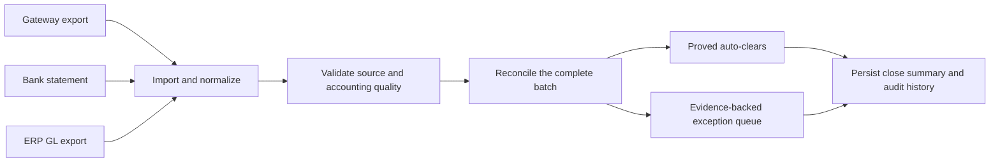
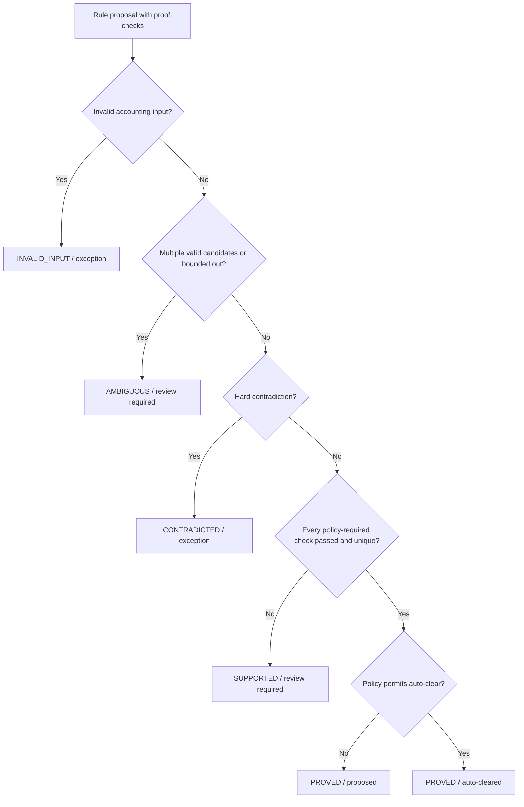
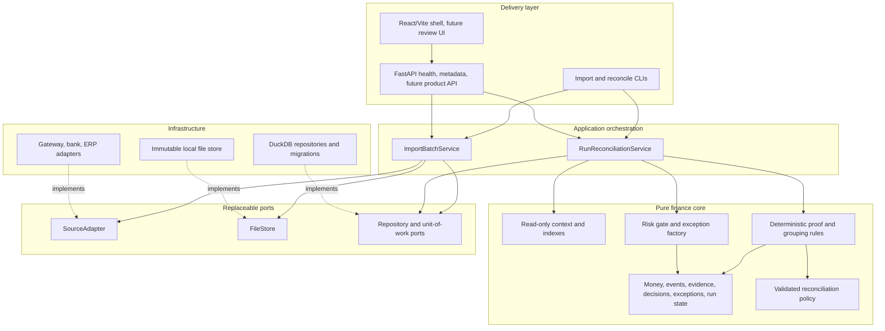
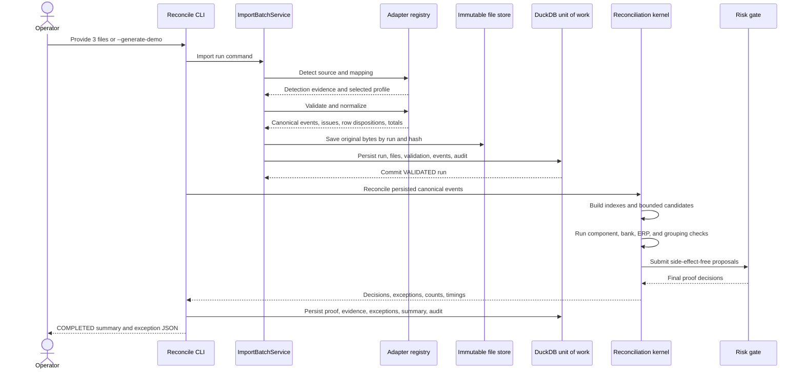
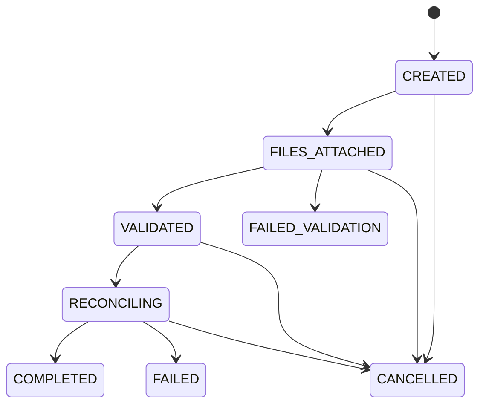
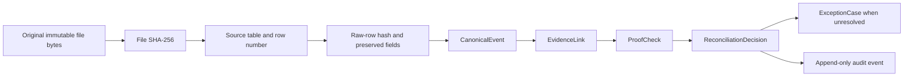
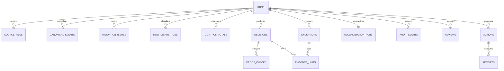
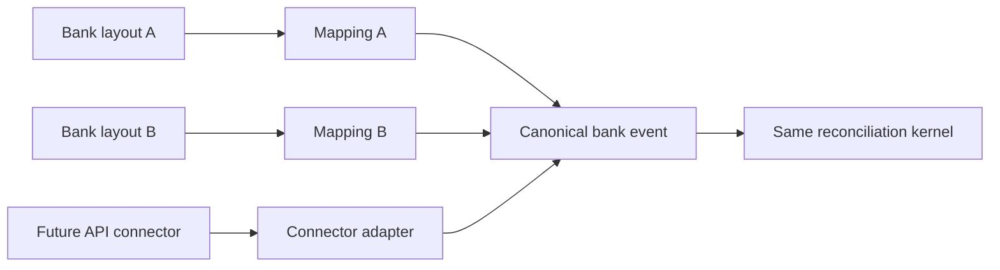
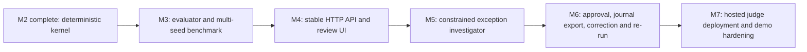

# VeriClose Implementation and Architecture Report

**Project:** VeriClose — Evidence-first settlement-to-ERP reconciliation  
**Hackathon track:** Razorpay Track 04 — AI Finance Controller  
**Implementation status:** M0, M1, and M2 complete through Segment 4  
**Report date:** 27 August 2026

---

## 1. Executive summary

VeriClose currently closes one concrete finance-operations loop across an entire synthetic batch:

> Gateway settlement data → bank receipts → ERP general-ledger postings → deterministic proof →
> auto-clear or evidence-backed exception.

It is not a chatbot that guesses whether two rows look similar. It is a verification system. Every
case must end in one of five explicit proof levels:

- `PROVED`: all policy-required hard checks passed and the evidence group is unique.
- `SUPPORTED`: useful evidence exists, but at least one required fact is missing or only advisory.
- `AMBIGUOUS`: more than one valid candidate or grouping exists, so the system abstains.
- `CONTRADICTED`: source evidence conflicts with an accounting or identity invariant.
- `INVALID_INPUT`: the source itself is not accounting-valid, such as an unbalanced journal.

Only `PROVED` cases can be auto-cleared, and only when the policy explicitly allows it. Fuzzy text
or a high support score can never produce proof.

The current default seed-42 demonstration processes 315 source rows and produces 25 case-level
decisions:

| Operational result | Count |
|---|---:|
| Canonical source events | 315 |
| Decisions | 25 |
| Proved auto-clears | 15 |
| Supported cases | 3 |
| Ambiguous cases | 2 |
| Contradicted cases | 4 |
| Invalid-input cases | 1 |
| Total exceptions | 10 |
| Operational verification rate | 60% |
| Deterministic amount at risk | ₹47,212.29 |

These are operational outputs for one known demonstration seed. They are not accuracy claims.
Formal multi-seed accuracy, precision, recall, false-clear rate, and regression thresholds belong
to Segment 5.

---

## 2. The finance problem being solved

A settlement may be represented differently in each system:

- The payment gateway lists payments, refunds, fees, taxes, adjustments, and a net settlement.
- The bank statement shows one receipt, multiple tranches, a delayed receipt, a typo, or nothing.
- The ERP records bank, clearing, fee, and tax journal lines under accounting account codes.

A finance operator must establish whether all three representations describe the same economic
movement and whether the accounting remains correct. A shared amount is insufficient evidence:
two unrelated receipts can have the same value. An exact reference is also insufficient if the
amount is wrong or the reference occurs twice.

VeriClose therefore answers four questions for every settlement:

1. Does the gateway's component arithmetic produce the stated net settlement?
2. Did the bank receive that amount in the correct direction and permitted date window?
3. Did the ERP post the right amounts, directions, accounts, and balanced journal?
4. Is the complete evidence group unique enough to clear without human judgment?

### Business loop currently closed



The current loop stops after producing persisted decisions and an exception JSON artifact.
Human review screens, correction approval, journal export, and re-run workflows are planned later.

---

## 3. What has been built

### 3.1 M0 — Deployable walking skeleton

The foundation proves that the project can be installed, tested, built, and run by another person.

| Component | What it does | Why it is useful |
|---|---|---|
| FastAPI application | Serves liveness, readiness, metadata, API documentation, and production assets | Gives one stable backend/runtime entry point |
| React and Vite shell | Provides the frontend build and future review-interface boundary | Avoids mixing finance calculations into UI code |
| Typed settings | Controls environment, paths, policy version, rule version, demo mode, and optional model access | Makes judge and hosted deployments reproducible |
| Multi-stage Docker image | Builds the frontend and locked Python runtime into one non-root image | Gives judges a repeatable artifact instead of local-machine assumptions |
| Health and smoke checks | Verifies configuration, writable storage, policy loading, metadata, and production HTML | Detects packaging and deployment failures early |
| Locked dependencies | Uses `uv.lock` and `pnpm-lock.yaml` | Prevents dependency drift during judging |

The application does not require an AI credential. Missing model credentials are reported as a
deterministic fallback and do not disable finance functionality.

### 3.2 M1 — Synthetic data, adapters, validation, and canonical storage

M1 creates reliable input evidence before matching begins.

#### Synthetic company generator

The generator creates a reproducible gateway, bank, and ERP world from a seed. It outputs:

```text
inputs/gateway.csv
inputs/bank.csv
inputs/erp_gl.csv
manifest.json
private/ground_truth.json
```

The public inputs contain no case labels. Ground truth is isolated under `private/` and runtime
modules do not import it. This prevents the reconciliation engine from cheating.

The default dataset contains:

| Source | Rows | Examples of information |
|---|---:|---|
| Gateway | 193 | payments, refunds, fees, taxes, net settlements, settlement references |
| Bank | 26 | credits, dates, UTRs, narration, account reference |
| ERP GL | 96 | journal lines, debit/credit, account, posting date, external reference |
| Total | 315 | complete batch processed in one run |

Controlled scenarios include clean settlements, many payments to one settlement, partial bank
tranches, later refunds, working-day shifts, mistyped references, missing sources, duplicate ERP
postings, amount mismatches, incorrect fees or tax, unbalanced journals, equal-amount ambiguity,
and orphan bank credits.

#### Source adapters and mapping profiles

Each source implements the same contract:

```text
detect(document)
validate(document, mapping)
normalize(document, mapping, context)
control_totals(events)
```

Three real adapters exist:

- Razorpay-style gateway adapter
- Generic bank-statement adapter
- Generic ERP general-ledger adapter

Versioned YAML mapping profiles absorb column-name and layout differences. Two different layouts
can therefore normalize into the same canonical event without changing reconciliation rules.

Mappings support reviewed aliases and a safe transform allowlist. They do not execute arbitrary
expressions from YAML.

#### Exact tabular parsing

CSV and XLSX inputs are supported. Money is never passed through binary floating point. Amounts
are converted into integer minor units, such as paise, and XLSX numeric cells are parsed from the
workbook XML using decimal-safe logic.

This matters because a finance controller cannot tolerate a one-paise difference introduced by
software representation.

#### Staged validation

Validation follows this order:


Every issue can contain:

- source file and table/sheet
- row and field
- supplied value
- stable error code
- human-readable message
- suggested correction
- severity and blocking status

Bad individual rows are quarantined rather than silently dropped. An unbalanced ERP journal stays
available as canonical evidence while also producing visible accounting issues. This allows the
reconciliation kernel to classify it as `INVALID_INPUT` instead of pretending it never existed.

#### Canonical event model

All adapters emit immutable `CanonicalEvent` values containing:

- stable event and source-record identity
- run and legal-entity identity
- source and event type
- non-negative integer amount plus explicit `DEBIT` or `CREDIT`
- event date and optional value date
- external, settlement, payment, and UTR references
- optional account code and untrusted narration
- exact source-file, source-row, file-hash, and raw-row-hash lineage
- mapping-profile version

Reconciliation rules depend only on these canonical fields. They never depend on CSV headers,
Excel sheets, FastAPI, DuckDB, or a model SDK.

### 3.3 M2 — Deterministic verification kernel

M2 turns canonical evidence into safe decisions.

#### Versioned finance policy

`razorpay_inr_v1@1.0.0` defines:

- allowed currency and date windows
- component signs
- exact amount tolerances
- ERP account roles and required directions
- candidate and grouping limits
- required proof checks for auto-clear
- advisory support-scoring weights
- exception reason, category, severity, recommended action, and company-input behavior

The policy is validated when the application composition root starts. A configured version that
does not match the loaded file prevents startup rather than silently changing accounting behavior.

The current gateway settlement equation is:

```text
Expected net
  = payments
  - refunds
  - fees
  - taxes
  ± policy-directed adjustments
```

The ERP proof expects:

- bank account: debit for the net receipt
- clearing account: credit for gross payments less refunds and adjustments
- fee account: debit for gateway fees
- tax account: debit for gateway tax
- total journal debits equal total journal credits

The bank statement uses a credit for incoming cash, while the ERP bank asset uses a debit. The
policy makes this system-specific direction difference explicit.

#### Candidate context and indexes

The kernel builds immutable indexes by:

- settlement reference
- UTR
- external reference
- amount in minor units
- date bucket

Candidates are blocked before deeper logic by legal entity, currency, compatible event type,
configured date range, and already-consumed event IDs. Rules query a read-only reconciliation
context rather than scanning repositories.

#### Proof rules

For each gateway settlement, the kernel performs:

1. Unique gateway settlement-row check.
2. Component arithmetic and variance check.
3. Bank receipt presence, amount, direction, reference, date, and uniqueness checks.
4. ERP journal presence, uniqueness, balance, and account-role checks.
5. Bounded one-to-many grouping for cases such as bank tranches.
6. Orphan detection for unused bank or ERP evidence.

Every required assertion becomes a `ProofCheck` with expected value, observed value, tolerance,
pass/fail status, and source evidence links.

#### Bounded grouping

Grouping supports legitimate complexity without introducing unlimited subset search:

- maximum candidate count
- maximum group size
- bounded number of valid groups retained
- deterministic ordering
- configured date window

If two different groups satisfy the amount, the result is `AMBIGUOUS`. The kernel never chooses
the first result merely because it was found first.

#### Advisory support scoring

When hard proof fails, candidates may receive an interpretable score based on:

- amount equality
- reference agreement
- date distance
- narration similarity

The feature breakdown is preserved as non-required support checks for review. Scoring is skipped
for cases already fully proved, and it cannot bypass a failed accounting invariant or create
`PROVED`.

#### Risk gate

The risk gate is the only component allowed to create final dispositions.



Examples:

- Exact UTR plus wrong amount becomes `CONTRADICTED`, not cleared.
- One correct amount with a mistyped UTR becomes `SUPPORTED`.
- Two equal-amount bank candidates become `AMBIGUOUS` even if one reference looks better.
- A missing ERP journal prevents complete proof.
- An unbalanced ERP journal becomes `INVALID_INPUT`.

#### Exception factory

Every non-proved decision becomes an `ExceptionCase` containing:

- stable case and reason code
- proof level
- category and severity
- deterministic amount at risk
- all evidence rows
- rules attempted
- whether company input is required
- recommended next action

An unknown unresolved state remains a valid fallback. No unresolved case is allowed to lack an
explanation category or evidence.

---

## 4. Complete architecture

### 4.1 Layered architecture



Dependencies point inward. Infrastructure knows the domain, but the domain does not know DuckDB,
FastAPI, CSV, XLSX, or React. This makes later replacement with PostgreSQL, cloud storage, or a new
input connector possible without rewriting accounting rules.

### 4.2 End-to-end execution flow



### 4.3 Run-state machine



State is append-only: each transition creates a new run snapshot. A failed kernel or persistence
operation cannot leave the run looking completed.

### 4.4 Evidence and lineage chain



This chain answers a finance practitioner's central question: “Show me exactly which source rows
and calculations produced this decision.”

### 4.5 Persistence architecture

DuckDB is accessed only through repository ports and an explicit unit of work. Current tables
include:



The review, action, and receipt tables already reserve append-only boundaries for later workflow
segments. Production ERP write-back is not implemented.

---

## 5. Component map: what helps with what

| Area | Main files | Responsibility | Practical value |
|---|---|---|---|
| Canonical finance model | `core/vericlose/domain/` | Money, directions, events, proof, decisions, exceptions, actions, run lifecycle | One stable accounting language across all inputs |
| Source contracts | `core/vericlose/ports/source_adapter.py` | Defines detect/validate/normalize/control-total behavior | New file formats can be added consistently |
| Mapping engine | `core/vericlose/ingestion/mappings.py` and `config/mappings/` | Versioned aliases and safe transforms | Handles company-specific columns without contaminating matching rules |
| Exact readers | `core/vericlose/ingestion/tabular.py` | CSV/XLSX parsing without float money | Prevents rounding-driven reconciliation errors |
| Real adapters | `core/vericlose/adapters/` | Gateway, bank, and ERP source interpretation | Converts system-specific exports into canonical evidence |
| Validation | `core/vericlose/ingestion/validation.py` | Cross-source readiness and precise diagnostics | Stops unsafe matching while retaining explainable errors |
| Import service | `core/vericlose/ingestion/service.py` | Coordinates detection through persistence | Creates one reproducible validated run |
| Policy pack | `config/policies/razorpay_inr_v1.yaml` | Accounting rules and operational behavior | Keeps business policy visible and versioned |
| Candidate indexes | `core/vericlose/reconciliation/context.py` and `indexes.py` | Bounded source-neutral lookups | Improves throughput and prevents impossible matches |
| Proof rules | `core/vericlose/reconciliation/rules/` | Component, bank, ERP, grouping, and support logic | Establishes why a settlement can or cannot clear |
| Risk gate | `core/vericlose/reconciliation/risk_gate.py` | Owns final proof level and auto-clear permission | Prevents scores or individual rules from clearing unsafely |
| Exception factory | `core/vericlose/reconciliation/exception_factory.py` | Reason, severity, risk, action, and ownership hints | Turns abstention into actionable finance work |
| Close pipeline | `core/vericlose/reconciliation/pipeline.py` | Runs the whole batch deterministically | Produces consistent decisions instead of cherry-picked matches |
| Run orchestration | `core/vericlose/application/run_reconciliation.py` | State, persistence, timing, audit, and failure handling | Makes a reconciliation run operationally trustworthy |
| Immutable storage | `core/vericlose/infrastructure/local_file_store.py` | Content-hashed, run-scoped source preservation | Prevents evidence from being silently overwritten |
| DuckDB repositories | `core/vericlose/infrastructure/duckdb/` | Transactional append-only persistence | Provides a portable judge-local database with clean replacement ports |
| Synthetic generator | `synthetic/` | Reproducible company, edge cases, and private truth | Enables honest batch evaluation without client data |
| Delivery commands | `scripts/import_batch.py`, `scripts/reconcile.py`, `Makefile` | Judge and developer entry points | Makes the current product usable without unfinished UI screens |
| Deployment | `Dockerfile`, `DEPLOYMENT.md`, smoke scripts | Non-root image and external verification | Proves the repository is runnable by judges |

---

## 6. Why the architecture is useful beyond the hackathon

### 6.1 New input layouts do not require new matching logic

A company can add a new bank CSV or ERP export by adding an adapter/profile at the outside edge.
Once normalized, the same policy and proof rules operate on it.



This is the horizontal part of the project's “T”: more sources and layouts can be connected
without weakening the deep settlement-to-ERP proof path.

### 6.2 Accounting policy is not hidden inside Python branches

Account codes, tolerances, date windows, signs, and exception behavior are versioned configuration.
A practitioner's review can therefore focus on an inspectable policy file rather than hunting
through unrelated code.

### 6.3 The database can be replaced

Application services depend on repository protocols. DuckDB is appropriate for a portable
hackathon and local-controller product, while PostgreSQL can later implement the same ports for a
multi-user hosted service.

### 6.4 AI can be added without owning accounting truth

The future investigation agent can explain an exception, rank evidence, or draft a clarification
request. It does not need permission to change a proof level, edit source evidence, or post a
journal. This contains model risk and demonstrates appropriate AI judgment.

---

## 7. Failure recovery and safety behavior

| Failure | Current response | Why it is safe |
|---|---|---|
| Malformed CSV/XLSX | File/schema diagnostic with suggested fix | Matching does not receive invented rows |
| Invalid row | Explicit quarantine and issue code | The row is not silently dropped |
| Duplicate file content | SHA-256 duplicate rejection within the run | Prevents double ingestion |
| Ambiguous adapter/profile | Requires explicit confirmation | Wrong source interpretation is not guessed |
| Cross-entity/currency input | Readiness failure before matching | Impossible candidates never enter rules |
| Excessive candidate/group size | Bounded-out ambiguity | Computation limits cannot force a guess |
| Equal-amount alternatives | `AMBIGUOUS` | Amount alone cannot auto-clear |
| Wrong exact-reference amount | `CONTRADICTED` | Identifier agreement cannot override arithmetic |
| Missing bank or ERP source | `SUPPORTED` plus missing-source exception | Partial evidence is retained without claiming proof |
| Unbalanced ERP journal | `INVALID_INPUT` and correction action | Accounting-invalid input cannot clear |
| Kernel or persistence exception | Run transitions from `RECONCILING` to `FAILED` | Failed runs never appear complete |
| Missing model credential | Deterministic fallback | Core finance workflow remains available |
| Host bind-mount restrictions | `--generate-demo` performs the proof inside an anonymous container volume | Judge proof no longer depends on host-volume permissions |

All source and canonical records are append-only. Re-import uses a new run/version rather than
rewriting the earlier close.

---

## 8. Testing and verification

The current release gate passes 156 backend tests plus frontend checks.

Coverage includes:

- domain money, direction, evidence, decision, exception, action, and run invariants
- source-adapter shared contracts
- CSV and XLSX parsing
- alternate mapping layouts
- decimal precision and date conversion
- file, schema, semantic, accounting, and cross-source validation
- immutable file storage and traversal protection
- DuckDB migrations, repository round trips, and transaction rollback
- policy validation and startup-version mismatch
- candidate bounds and deterministic grouping
- every proof-level risk-gate transition
- all default synthetic scenarios
- no false clears for labelled non-proved scenarios
- reversed input ordering producing identical decisions
- wrong-account adversarial behavior
- explicit failed-run recovery
- truth isolation from runtime modules
- production API readiness, metadata, and static assets

Verified commands:

```bash
make verify
make image
make smoke-container
```

The final image has also run a full 315-record close entirely inside an anonymous Docker volume.

---

## 9. How to run what exists

### Native development proof

```bash
make setup
make generate
make reconcile CLOSE_RUN_ID=demo-close-v1
```

The close command writes a machine-readable summary and an exception JSON file. Use a new run ID
for another immutable version.

### Import only

```bash
make import-batch RUN_ID=demo-import-v1
```

This stops at `VALIDATED` and is useful for testing mappings and source quality independently from
matching.

### Judge-facing image

```bash
make image
make judge
```

Then open:

- Product shell: <http://localhost:8000>
- API documentation: <http://localhost:8000/docs>
- Readiness: <http://localhost:8000/health/ready>
- Metadata: <http://localhost:8000/api/meta>

### Mount-free close inside the production image

```bash
docker run --rm -v /app/data vericlose:dev \
  python -m scripts.reconcile --generate-demo \
  --run-id judge-seed-42 \
  --data-dir /app/data \
  --database /app/data/vericlose.duckdb \
  --exceptions-output /app/data/exceptions.json
```

---

## 10. Current product boundary

### Supported now

- One merchant/legal entity per run
- INR
- CSV and XLSX
- One gateway source, one bank statement, and one ERP GL source
- Synthetic data for development and judging
- Deterministic settlement-to-bank-to-ERP verification
- Complete-batch processing
- Immutable evidence and append-only decisions
- Operational close summary and exception export
- Model-optional deployment

### Intentionally not built yet

- Formal Segment 5 evaluator and multi-seed benchmark reports
- Accuracy, precision, recall, false-clear-rate, and threshold enforcement commands
- HTTP upload, mapping-confirmation, evidence-review, and dashboard screens
- Human approval/rejection workflow in the UI
- Journal proposal/export and corrected-data re-run loop
- LLM exception explanations or settlement Q&A
- Authentication, organization isolation, and production authorization
- PostgreSQL/object-storage hosted profile
- Direct production ERP write-back
- Multi-currency or multi-entity reconciliation
- General ERP migration engine

The current React interface is a deployable shell, not the finished finance review experience. The
fully working product path is the CLI and Docker close command.

---

## 11. Recommended next build order



The immediate next step is Segment 5 because UI polish should not hide unsafe matching behavior.
The evaluator should calculate:

- group-membership correctness
- auto-match precision
- verified-match rate
- false-clear count and rate
- exception recall
- per-scenario and per-rule outcomes
- amount-weighted error
- runtime and throughput across multiple seeds

Only after those metrics are trustworthy should the review dashboard present them.

---

## 12. Five-minute architecture explanation

A concise judge explanation can follow this sequence:

1. **Problem:** the same settlement appears as gateway components, bank cash, and ERP accounting.
2. **Risk:** matching by amount, text, or one identifier can falsely clear financial errors.
3. **Input layer:** adapters and versioned mappings normalize different file layouts without
   leaking source columns into finance rules.
4. **Evidence layer:** every canonical value retains file hash, source row, raw-row hash, and
   mapping version.
5. **Proof layer:** policy-driven integer arithmetic verifies gateway net, bank receipt, ERP
   balance, account roles, directions, timing, and uniqueness.
6. **Judgment layer:** one strict risk gate assigns five proof levels; support scores cannot clear.
7. **Operations layer:** decisions, checks, exceptions, timings, and audit events are committed
   transactionally; failures become explicit run states.
8. **Demonstration:** one command closes all 315 rows, reports 25 decisions, and lists the 10 cases
   it honestly could not clear.
9. **Next step:** evaluate across multiple hidden seeds before adding AI explanations or UI polish.

The central product statement is:

> VeriClose does not ask a finance team to trust an AI answer. It makes every answer cheaper and
> safer to verify.

---

## 13. Source-of-truth documents

- `PROJECT_PLAN.md` — product strategy and long-term architecture
- `TASKS.md` — delivery segments and acceptance gates
- `BUILD_STEPS.md` — implementation order and coupling guidance
- `DEPLOYMENT.md` — judge and hosted runbook
- `AGENTS.md` — repository engineering, finance-safety, and AI boundaries
- `README.md` — quickest developer and judge entry point

