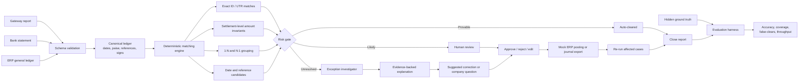
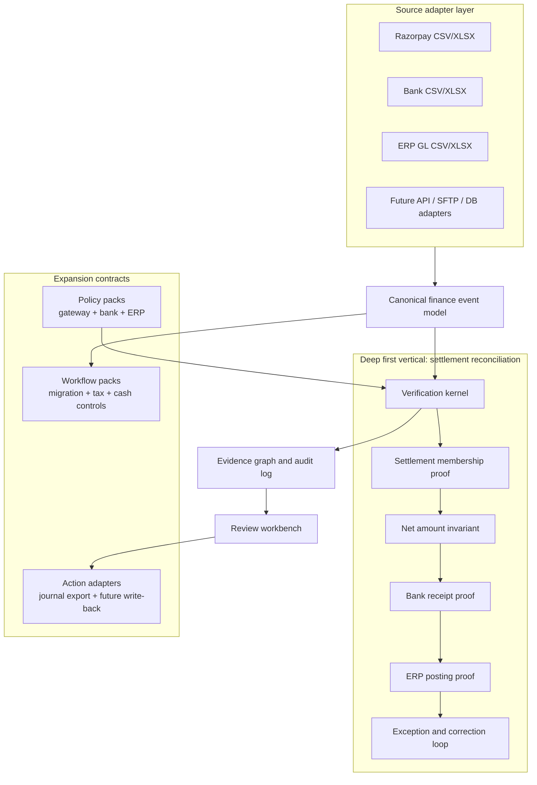
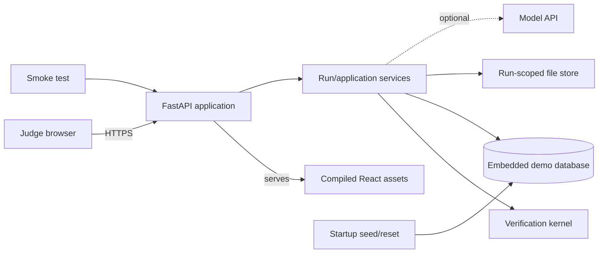

# VeriClose: AI Finance Controller

## Evidence-first settlement reconciliation for ERP teams

Your best project is not a generic “AI Finance Controller” chatbot.

Build **VeriClose: an evidence-first settlement-to-ERP reconciliation agent**.

It should accept payment-gateway, bank, and ERP exports; reconcile the entire batch; automatically clear only provable matches; explain anomalies; prepare correction entries; and leave an honest review queue for anything unsafe to resolve.

That is narrow enough to finish, substantial enough to matter, naturally related to Razorpay, and directly connected to your dad’s expertise.

## Executive build decision

VeriClose will be built as a **T-shaped product**:

- The deep vertical is Razorpay-style settlement-to-bank-to-ERP reconciliation. It must work end to end, be measurable, and demonstrate real accounting depth.
- The horizontal platform consists of stable adapters, a canonical finance model, configurable policy packs, an evidence graph, and review/action contracts. These make later payment gateways, banks, ERPs, file layouts, and finance-control workflows additive rather than rewrites.

The MVP is not a broad “reconcile anything” platform. It is one excellent reconciliation controller whose internal boundaries make expansion credible.

### Product promise

> For every source record, VeriClose will either prove where the money went, route the case for review with supporting evidence, or state exactly why it cannot decide.

### Non-negotiable product invariants

1. **Correctness before coverage.** It is better to abstain than to create a false-clear.
2. **Evidence before explanation.** Every status, narrative, and proposed action must point to source rows and deterministic calculations.
3. **Canonicalize once.** Source-specific fields end at the adapter boundary; matching rules operate only on canonical records.
4. **Policy is configuration.** Tolerances, account mappings, date windows, and auto-clear permissions must not be scattered through code.
5. **AI is advisory.** Model output can explain, rank, and draft; it cannot alter ledgers, calculate authoritative totals, or promote a case to auto-cleared.
6. **Runs are reproducible.** The same inputs, rule version, policy version, and model configuration must reproduce the same deterministic decisions.
7. **History is append-only.** Corrections and reviews create new events; original source values and previous decisions remain visible.
8. **Live and benchmark truth are separate.** Ground truth is available to the evaluation harness, never to the reconciliation engine.

### MVP scope boundary

The first complete version supports:

- One merchant/legal entity
- INR only
- CSV and XLSX uploads
- One Razorpay-style gateway export
- One bank statement
- One ERP general-ledger export
- Exact, invariant, grouped, and bounded candidate matching
- Review, journal proposal/export, correction import, and re-run
- A synthetic benchmark with hidden ground truth

The MVP explicitly does not include:

- Production credentials or direct ERP posting
- Multi-entity consolidation
- Foreign-exchange accounting
- Tax filing or statutory advice
- General ERP migration
- Unbounded autonomous actions
- A chat-first interface

This boundary protects delivery quality while preserving a clear expansion path.

## What Razorpay is actually asking for

They want evidence that your system can complete a real operational loop:

1. Take a batch containing at least 50 records.
2. Process every record—not a hand-selected example.
3. Make finance decisions accurately.
4. Measure those decisions against known ground truth.
5. Resolve safe cases.
6. Abstain on ambiguous cases.
7. Produce an exception list with reasons and next actions.

A dashboard saying “97% matched” is insufficient. Reviewers will want to know:

- Was that 97% actually correct?
- Were incorrect transactions silently cleared?
- Can every result be traced to its source rows?
- What happens with missing fields, duplicate records, refunds, partial settlements, or an unavailable AI model?
- Can a finance person approve and export the result?

The key deliverable is not an intelligent-looking conversation. It is a **verifiable batch-processing system**.

## The product I recommend

### VeriClose

> Upload a gateway settlement report, bank statement, and ERP general ledger. VeriClose verifies payment-to-settlement-to-bank-to-ERP movement, resolves deterministic cases, investigates differences, and exports a posting-ready close pack.

Your three sources:

1. **Payment gateway ledger**

   Payments, refunds, fees, taxes, settlement IDs, UTRs, timestamps and statuses.

2. **Bank statement**

   Credits, debits, value dates, descriptions and UTR/reference numbers.

3. **ERP general ledger**

   Bank postings, gateway clearing entries, fee accounts, input-tax accounts and external references.

This is authentic Razorpay territory: its reports associate transactions with settlement IDs, while UTRs identify bank settlements. Domestic settlement timing commonly follows working-day cycles, and partial settlements, fees, taxes, refunds and adjustments all create legitimate complexity. See the [Razorpay settlement FAQ](https://razorpay.com/docs/payments/settlements/faqs/?preferred-country=IN), [settlement breakdown documentation](https://razorpay.com/docs/payments/settlements/dashboard/?preferred-country=IN), and [partial-settlement documentation](https://razorpay.com/docs/payments/settlements/?preferred-country=IN).

## The complete workflow



The important part is the feedback loop:

**Detect → explain → approve → correct → re-run → confirm resolved**

That is what makes it a controller rather than an anomaly dashboard.

## T-shaped system design

The architecture has one verification kernel and three extension seams:



### Extension seam 1: source adapters

Every input implementation must satisfy the same contract:

```python
class SourceAdapter(Protocol):
    def detect(self, file) -> DetectionResult: ...
    def validate(self, file, mapping) -> ValidationReport: ...
    def normalize(self, file, mapping) -> list[CanonicalEvent]: ...
    def control_totals(self, events) -> ControlTotals: ...
```

The MVP should include three adapters:

- `RazorpaySettlementAdapter`
- `GenericBankStatementAdapter`
- `GenericERPGeneralLedgerAdapter`

File layouts may vary without changing the matching engine. Column aliases and transforms should live in versioned mapping profiles, for example `utr`, `bank_reference`, and `transaction_ref` mapping to the canonical `external_reference` field.

Add new formats in this order:

1. Alternate CSV/XLSX column layouts
2. Saved per-company mapping profiles
3. Additional gateway and ERP adapters
4. Read-only APIs or SFTP ingestion
5. Approved write-back adapters

### Extension seam 2: policy packs

A policy pack defines business-specific behavior without changing verification code:

- Currency and minor-unit rules
- Debit/credit sign interpretation
- Working-day and date-window behavior
- Amount tolerance
- Required identifiers
- Settlement component formula
- Chart-of-account mappings
- Auto-clear eligibility
- Review thresholds
- Allowed proposed actions

The first pack is `razorpay_inr_v1`. Later packs can represent a different gateway, merchant contract, bank format, or ERP posting convention.

### Extension seam 3: action adapters

The verification engine produces a typed `ProposedAction`; it never writes directly to an ERP.

MVP action adapters:

- Journal-entry CSV export
- Corrected-data import and affected-case re-run
- Draft company clarification request

Later action adapters:

- Infor, Tally, Zoho, SAP, or other ERP staging APIs
- Ticket creation
- Email or approval workflow
- Reversal and compensating-entry workflows

Every mutating adapter must require explicit approval, an idempotency key, a dry-run preview, and a result receipt.

## Data consolidation architecture

The data flow has three immutable layers:

1. **Raw source layer**

   Preserve the original file, file hash, sheet name, row number, original values, upload time, and detected format. Never rewrite uploaded evidence.

2. **Canonical event layer**

   Convert all sources into typed finance events while preserving lineage to the raw row.

3. **Decision and evidence layer**

   Store match groups, proof checks, exceptions, proposed actions, reviews, and re-run results separately from financial source data.

### Canonical event model

The stable model should include at least:

```text
event_id
run_id
source_type                 # GATEWAY, BANK, ERP
source_file_id
source_row_number
source_record_id
legal_entity_id
event_type                  # PAYMENT, REFUND, FEE, TAX, SETTLEMENT, JOURNAL...
amount_minor                # non-negative integer paise
direction                   # DEBIT or CREDIT
currency
event_at                    # timezone-aware timestamp
value_date
external_reference
settlement_reference
payment_reference
bank_utr
account_code
narration
raw_row_hash
mapping_profile_version
```

Do not discard the original sign or source amount. Store normalized direction separately and make any derived signed value explicit.

### Validation stages

Validation should happen before matching:

1. **File validation:** supported type, readable workbook/sheet, encoding, size and duplicate upload.
2. **Schema validation:** required fields, mapped aliases and parsable types.
3. **Semantic validation:** valid currency, non-negative canonical amount, legal dates, known event types and valid direction.
4. **Accounting validation:** balanced ERP journals, component control totals and expected debit/credit behavior.
5. **Cross-source readiness:** compatible date ranges, entity/currency agreement and minimum identifiers.

If validation fails, return exact file, sheet, row, field, supplied value, error code and suggested correction. Never quietly drop malformed rows.

### Core domain entities

- `RunManifest`: input hashes, versions, state, timings and totals
- `SourceFile` and `SourceRow`: immutable provenance
- `CanonicalEvent`: normalized financial event
- `MatchGroup`: records believed to describe the same money movement
- `ProofCheck`: invariant, result, expected value, observed value and tolerance
- `EvidenceLink`: the row-level reason a decision was made
- `ExceptionCase`: reason code, severity, amount at risk and state
- `ProposedAction`: typed journal, clarification, remap, wait, or no-action proposal
- `ReviewDecision`: approve, reject, edit, reviewer and timestamp
- `ActionReceipt`: export/write result and idempotency information

These entities become the foundation for every later finance-control workflow.

## Synthetic data to generate

Do not use your dad’s client files. Take his knowledge, not confidential data.

Create a seeded generator such as:

```text
python generate.py --payments 250 --settlements 60 --exception-rate 0.15 --seed 42
```

Generate:

- 250 payment/refund events
- 60 settlement groups
- 60 corresponding or missing bank entries
- 150–250 ERP journal lines
- A separate hidden ground-truth file

Include realistic cases:

- Clean exact matches
- Multiple payments forming one settlement
- Partial settlement
- Refund deducted in a later settlement
- Working-day date shift
- UTR typo or missing reference
- Duplicate ERP posting
- Missing bank credit
- Missing ERP bank posting
- Incorrect gateway fee
- Incorrect GST/tax line
- Amount mismatch
- Orphan bank credit
- Unbalanced journal
- Ambiguous equal-amount candidates

Store monetary amounts as integer paise, never floating-point rupees.

The engine should never read `ground_truth.json`. Only the evaluation script reads it after reconciliation.

## Matching logic

Use staged matching:

1. **Exact reference matching**

   Settlement ID, payment ID, order ID, UTR and ERP external reference.

2. **Accounting invariant verification**

   Sum all signed payment, refund, fee, tax and adjustment components and verify that the computed settlement equals the bank credit and relevant ERP postings.

3. **Grouped matching**

   Handle one-to-many and many-to-one cases inside bounded date windows.

4. **Candidate matching**

   Use amount, date, extracted narration tokens and fuzzy reference similarity.

5. **Risk gate**

   - Exact and arithmetically verified: auto-clear.
   - Strong but non-unique candidate: review.
   - Contradictory or insufficient evidence: exception.

A critical principle:

> A high-confidence guess is not the same as an accounting proof.

### Verification kernel contract

Each matching rule returns a typed proposal rather than directly changing case status:

```text
MatchProposal
├── candidate_event_ids
├── rule_id and rule_version
├── proof_checks[]
├── uniqueness_result
├── evidence_links[]
├── reason_codes[]
├── support_score
└── proposed_proof_level
```

The risk gate converts proposals into decisions:

| Proof level | Meaning | Allowed system action |
|---|---|---|
| `PROVED` | Required identifiers, accounting invariants and uniqueness all pass | Auto-clear if policy allows |
| `SUPPORTED` | Strong evidence exists but at least one hard proof is missing | Human review |
| `AMBIGUOUS` | More than one viable candidate or insufficient evidence | Exception queue |
| `CONTRADICTED` | Sources disagree on amount, direction, identity or accounting behavior | High-priority exception |
| `INVALID_INPUT` | Source data did not pass validation | Block before reconciliation |

Confidence can rank review work, but confidence alone can never produce `PROVED`.

### Matching pipeline

1. Block candidates by entity, currency, date range and compatible event type.
2. Attempt stable identifiers such as settlement ID, UTR and ERP external reference.
3. Verify payment membership and settlement component totals.
4. Verify bank receipt amount, direction and allowed timing behavior.
5. Verify ERP bank, clearing, fee and tax postings and journal balance.
6. Attempt bounded one-to-many or many-to-one grouping.
7. Rank remaining candidates without clearing them.
8. Emit a decision with proof checks and reason codes.

Rules must be deterministic, side-effect free, independently testable, and replayable. Adding a source adapter must not require editing a match rule. Adding a rule must not require editing the UI.

### Exception taxonomy

Use stable machine-readable reason codes grouped into:

- `DATA_QUALITY`: missing or malformed required source values
- `REFERENCE`: missing, mistyped or conflicting identifiers
- `TIMING`: expected, delayed or impossible value-date behavior
- `AMOUNT`: settlement, fee, tax, refund or rounding variance
- `DUPLICATE`: repeated source row or duplicate accounting posting
- `MISSING_SOURCE`: expected bank, gateway or ERP event is absent
- `ACCOUNTING`: unbalanced journal, wrong direction or wrong account
- `POLICY`: no configured rule can safely decide the case
- `AMBIGUOUS`: multiple candidates remain equally plausible
- `UNKNOWN`: evidence is insufficient to classify honestly

Every exception must contain an amount at risk, evidence rows, rules attempted, current owner, recommended next action and whether company input is required.

## Where AI belongs—and where it should not

This is one of your strongest judging points.

Use deterministic code for:

- Arithmetic
- Ledger balancing
- Exact identifiers
- Date windows
- Tolerance policies
- Group matching
- Metrics
- Journal debit/credit validation

Use the LLM for:

- Interpreting messy bank narrations and ERP descriptions
- Explaining why a case failed
- Ranking ambiguous candidates
- Drafting a question for the company
- Turning structured evidence into controller-readable commentary
- Answering “Why is settlement X unresolved?”

Require structured AI output:

```json
{
  "hypothesis": "ERP GST input line appears to be missing",
  "evidence_row_ids": ["gateway_142", "erp_391", "bank_067"],
  "confidence": 0.87,
  "recommended_action": "PROPOSE_JOURNAL",
  "requires_human_approval": true
}
```

The AI must not:

- Modify input data
- Invent missing figures
- Calculate final balances independently
- Auto-post a journal
- Convert ambiguity into a fake match

If the AI API fails, matching and reporting should still work. Use a templated explanation as fallback.

### Bounded exception-investigator design

The “agent” is an explicit state machine, not an unconstrained autonomous loop:

```text
LOAD_CASE
  → FETCH_REFERENCED_EVIDENCE
  → SUMMARIZE_DETERMINISTIC_CHECKS
  → REQUEST_STRUCTURED_HYPOTHESIS
  → VALIDATE_EVIDENCE_IDS_AND_ACTION_TYPE
  → ATTACH_ADVISORY_OUTPUT
  → ROUTE_TO_REVIEW
```

Allowed read tools:

- `get_case(case_id)`
- `get_source_rows(row_ids)`
- `get_proof_checks(case_id)`
- `get_policy(rule_or_account)`
- `get_candidate_matches(case_id)`

Allowed output tools:

- `attach_explanation(...)`
- `queue_proposed_action(...)`
- `draft_clarification_request(...)`

There is no direct `post_journal`, `edit_source_row`, or `mark_auto_cleared` tool.

Model output validation must reject:

- Evidence IDs that do not exist or do not belong to the case
- Amounts that disagree with deterministic calculations
- Unsupported action types
- A claim of certainty when the proof level is not `PROVED`
- Invalid debit/credit proposals

Treat narrations, descriptions and uploaded cell text as untrusted data, not instructions. The model receives only the minimum relevant evidence, clearly delimited, and has no filesystem, network, or posting authority.

## Metrics the dashboard must show

Do not show only “match rate.”

| Metric | Definition |
|---|---|
| Verified match rate | Correctly verified records ÷ all eligible records |
| Auto-match precision | Correct auto-clears ÷ all auto-clears |
| Exception recall | True injected exceptions detected ÷ all injected exceptions |
| False-clear rate | Bad records incorrectly marked clean ÷ all bad records |
| Unresolved rate | Cases needing external information ÷ all cases |
| Throughput | Records processed ÷ execution time |
| Amount at risk | Total value represented by unresolved cases |

Show results by matching rule as well. For example, exact UTR matches may be perfect while fuzzy narration matches require review.

Your target should be high precision, not artificially high coverage:

- Aim for at least 99% auto-clear precision.
- Aim for at least 90% exception recall.
- Treat any silent false-clear as a serious failure.
- It is acceptable to leave difficult cases unresolved.

These are targets until your evaluator produces real results—never hardcode or claim them beforehand.

Run the benchmark over multiple seeds, not just the demo dataset:

```text
make benchmark   # 10 seeds, perhaps 2,500+ total payment records
```

That directly answers “one cherry-picked match proves nothing.”

### Never mix operational metrics with benchmark accuracy

In a synthetic benchmark, hidden ground truth allows the product to display precision, recall and false-clear rate. A live customer batch does not normally have ground truth, so those metrics are unknowable at run time.

The UI must therefore have two clearly labelled views:

**Operational run view**

- Records and rupees verified
- Records and rupees awaiting review
- Unresolved amount at risk
- Exceptions by reason code
- Processing time and rule coverage
- Reviewer actions and completion state

**Benchmark view**

- Auto-match precision
- Exception recall
- False-clear rate
- Match accuracy by rule and scenario
- p50/p95 runtime and records per second
- Results across seeds and dataset sizes

This distinction prevents a misleading “AI accuracy” claim in production.

### Evaluation levels

Measure at both levels:

1. **Event level:** was each source record assigned to the correct match group and disposition?
2. **Case level:** did the system correctly prove or reject the complete gateway-bank-ERP movement?

The benchmark report must include the confusion matrix and raw incorrect case IDs so reviewers can inspect failures rather than only seeing aggregates.

Use three test sets:

- **Generated regression suite:** many deterministic seeds and configurable exception rates
- **Curated golden suite:** small, difficult, human-labelled scenarios added after practitioner review
- **Adversarial suite:** duplicates, corrupted references, equal amounts, prompt-like narrations, boundary dates and invalid journals

Keep benchmark targets in configuration and CI, never in UI source code. A failing target should fail the benchmark command rather than being cosmetically hidden.

## Practical architecture

Keep it a modular monolith:

```text
vericlose/
├── README.md
├── DEPLOYMENT.md
├── BUILD_STEPS.md
├── apps/
│   ├── api/                 # FastAPI
│   └── web/                 # React + Vite
├── core/
│   ├── domain/              # canonical types and invariants
│   ├── adapters/            # source and action contracts
│   ├── ingestion/           # raw files, mappings and validation
│   ├── normalization/       # source-to-canonical transforms
│   ├── reconciliation/      # rules, candidates and risk gate
│   ├── investigation/       # bounded LLM investigator
│   ├── workflow/            # review, actions and re-runs
│   └── audit/               # manifests, lineage and receipts
├── config/
│   ├── mappings/            # versioned source profiles
│   └── policies/            # reconciliation policy packs
├── synthetic/
│   ├── generator.py
│   ├── scenarios/
│   └── truth/               # isolated from runtime imports
├── evaluation/
│   ├── benchmark.py
│   ├── metrics.py
│   └── reports/
├── tests/
│   ├── unit/
│   ├── integration/
│   ├── golden/
│   └── adversarial/
├── docs/
│   ├── architecture.md
│   ├── matching-rules.md
│   ├── failure-modes.md
│   └── adr/
├── scripts/
│   ├── smoke.py
│   └── wait_for_ready.py
├── AGENTS.md                # create before implementation begins
├── Makefile
├── Dockerfile
└── docker-compose.yml
```

Recommended stack:

- Python, FastAPI and Pydantic
- DuckDB and local files for hackathon batch storage; hide persistence behind repositories so it can later move to PostgreSQL and object storage
- Pandas or Polars for normalization, choosing one rather than mixing both
- React/Vite for a polished review interface
- Pytest for scenario and invariant tests
- Direct model API with validated JSON output
- A multi-stage Dockerfile that builds the frontend and packages one production application image

You do not need Kafka, microservices, a vector database, a multi-agent swarm or a large agent framework.

React/Vite is the primary UI choice because evidence comparison, review state, and reusable workbench components matter to the product. If schedule risk becomes critical, reduce animation and visual polish before replacing the architecture with a throwaway frontend.

### Deployment shape

During development, Vite and FastAPI run separately for fast reloads. In the production build, Vite emits static assets that FastAPI serves beside `/api/*` on the same origin. The judge therefore runs one container, one application process, one local database and one local raw-file directory. Reconciliation executes in-process behind a job interface. Do not add a queue merely to look production-grade.

Use one application worker for the hackathon build because the embedded database and in-process run coordinator are intentionally single-instance. Document that constraint rather than implying horizontal scalability.

For a later pilot, the same logical interfaces can move to:

- PostgreSQL for tenant, workflow and audit state
- Object storage for immutable raw files and exported artifacts
- A worker queue for large or concurrent batches
- Tenant-scoped encryption, access controls and retention policies

None of that belongs in the hackathon critical path.

## Judge execution and deployment contract

Deployment is a submission feature. The project is not considered complete merely because it runs on the developer’s laptop.

### Required judge paths

Provide all three paths:

1. **Hosted demo URL**

   A judge can open the product, load a pre-generated batch, execute reconciliation, inspect evidence, review an exception and complete the correction/re-run loop without installing anything.

2. **Container path**

   A judge can clone the repository and run one documented command such as:

   ```text
   docker compose up --build
   ```

   The UI becomes available on a documented localhost port. No model key is required for deterministic reconciliation.

3. **Native developer path**

   `make setup && make dev` remains available when Docker is unavailable. It may start the frontend and API separately, but it must use the same domain code and fixtures as the container.

### Runtime profiles

| Profile | Purpose | Persistence | Model behavior |
|---|---|---|---|
| `development` | Fast local iteration | Local run directory | Optional live model or fallback |
| `judge-local` | Clone-and-run evaluation | Named container volume | Optional key; deterministic fallback works |
| `hosted-demo` | Zero-install public judging | Ephemeral reset or mounted volume | Server-side key if configured; fallback otherwise |
| `benchmark` | Reproducible accuracy evaluation | Isolated output directory | Model disabled unless explicitly testing it |

### Single-image production layout



The browser never receives model credentials. The model provider is optional and called only from the server.

### Required deployment behavior

- `/health/live` confirms the process is alive.
- `/health/ready` confirms policies, database, writable storage and static assets are ready.
- `/api/meta` reports build commit, rule version, policy version and demo mode without leaking secrets.
- The app binds to configurable host and port values.
- All writable paths come from configuration and work inside a container.
- Startup creates required directories and schema safely.
- The hosted demo can reset to a known seed without rebuilding the image.
- Missing model credentials activate a clearly labelled deterministic fallback.
- The production UI and API share an origin, avoiding fragile CORS configuration.
- Uploaded filenames are not trusted as filesystem paths.
- Upload type and size are restricted; files are stored under generated IDs.
- Demo data has a retention/reset policy and a visible “synthetic data only” notice.

### Reproducible build requirements

- Pin Python and JavaScript dependencies through lock files.
- Use a multi-stage build so Node tooling is absent from the final runtime image.
- Run the container as a non-root user.
- Include a `.dockerignore` and exclude truth outputs, secrets, caches and local databases.
- Build for the architecture used by the deployment target and document it.
- Expose no shell or debug mode in the hosted profile.
- Ensure timestamps and seeded data do not make tests nondeterministic.

### Deployment smoke test

One command must verify the deployed system from outside the process:

```text
make smoke BASE_URL=http://localhost:8000
```

The smoke test must:

1. Verify liveness and readiness.
2. Load or generate the known demo batch.
3. Start a reconciliation run.
4. Poll until a terminal state.
5. Assert that record totals and case totals are non-zero.
6. Open one proved case and verify evidence links exist.
7. Open one unresolved case and verify a reason code exists.
8. Exercise model fallback when no key is present.
9. Export one artifact.

Add a browser-level smoke test for the principal UI path if time permits, but never substitute browser screenshots for the API-level deployed smoke test.

### Hosted-demo constraints

The hosted demo is a single-tenant judging environment, not a production accounting service. Restrict it to synthetic data, small files and short retention. If public uploads are enabled, display that warning before upload and automatically purge data. Do not accept or claim to protect real company finance data until authentication, tenant isolation, encryption, retention and security review exist.

Model the run as a state machine:

```text
UPLOADED → VALIDATED → NORMALIZED → MATCHED → REVIEWED → EXPORTED
              ↓                         ↓
      FAILED_VALIDATION          NEEDS_INFORMATION
```

Every run should store:

- Source-file hashes
- Rule-engine version
- Model and prompt version
- Source row IDs used for every decision
- Match rule attempted
- Human approvals or overrides
- Exported correction
- Reconciliation result after correction

## UI and interaction architecture

The home page should be a run inbox, not a chatbot. The primary object is a reconciliation run; chat is a secondary way to inspect a completed run.

### Screen 1: import and mapping

- Three clearly labelled source slots: gateway, bank and ERP
- Auto-detected adapter and mapping profile
- Spreadsheet preview with canonical field mappings
- Required-field and row-level errors before execution
- Control totals for record count, debit, credit and date range
- Explicit confirmation for inferred mappings

Never silently infer a required financial field.

### Screen 2: run cockpit

Show the operational state of the batch:

- Verified versus review versus unresolved record counts
- Verified and unresolved rupee amounts
- Exceptions grouped by reason and severity
- Pipeline stage and processing time
- Clear link to the benchmark report when the run is synthetic

Avoid a wall of decorative KPI cards. Lead with the reconciliation status and amount exposure.

### Screen 3: case workbench

This is the product’s most important screen. It should show:

- Gateway, bank and ERP evidence in aligned source panels
- A movement timeline
- The reconciliation equation with expected, observed and variance values
- Proof checks with pass/fail state
- Rules attempted and proof level
- Agent hypothesis visibly separated from verified facts
- Proposed next action
- Approve, reject, edit, request information and defer controls

An explanation without visible source rows should never be shown as sufficient evidence.

### Screen 4: action and re-run

- Preview proposed journal lines with debit/credit balance
- Require reviewer confirmation
- Export a journal file or import corrected mock ERP data
- Re-run only affected cases
- Show before/after state and preserve the original decision

### Screen 5: audit and benchmark

- Download close report, exception pack, audit log and journal proposal
- Inspect file, mapping, policy, rule, model and prompt versions
- Show seed-level benchmark results and incorrect case IDs
- Distinguish model fallback runs from model-assisted runs

### UX principles

- Evidence precedes narrative.
- Status is communicated by text and icon, not color alone.
- Rupee formatting preserves exact paise and direction.
- Original and normalized values can be compared.
- Destructive or posting-like actions always have a preview and confirmation.
- High-value and high-severity cases are easy to prioritize.
- Empty, loading, validation-failure, model-unavailable and no-match states are intentionally designed.
- The complete demo path should require no hidden terminal steps after startup.

## Failure recovery to demonstrate

Deliberately show at least one failure in the video:

- Malformed CSV → reject with exact row and field.
- Duplicate upload → recognize file hash and avoid duplicate processing.
- LLM timeout → fall back to deterministic explanation.
- Ambiguous candidates → abstain instead of choosing.
- Correction applied twice → idempotency key prevents duplicate posting.
- User rejects a suggestion → preserve both original and reviewed decision.
- Re-uploaded corrected file → create a new version rather than destroying history.

For the demo, close the loop with an approved journal export and corrected mock ERP-data import:

1. Agent proposes a journal.
2. User approves it.
3. System exports the balanced journal proposal.
4. Corrected mock ERP data is imported as a new version.
5. System re-runs that settlement.
6. Exception changes to resolved.

If time permits, a mock action adapter may automate steps 3–4, but the journal preview and audit receipt must remain visible. For real systems, produce a posting-ready CSV until you have safe ERP access.

## Practitioner-in-the-loop development model

Most entrants can write matching code. Very few know what a controller considers sufficient evidence. Your dad’s value is his judgment, review sequence and exception knowledge—not access to confidential company files.

The first practitioner session should happen at approximately **65% completion**, not at the idea stage. By then, you will have something concrete enough for him to criticize accurately and enough remaining flexibility to change the rules, data and interface.

### What must exist before the 65% review

- Seeded synthetic generator and isolated ground truth
- All three source adapters and canonical normalization
- Exact, invariant and grouped matching
- Strict proof-level risk gate
- Evaluation harness with per-rule errors
- Thin run cockpit and case workbench
- Evidence rows and proof checks visible
- Initial exception taxonomy
- At least 12 deliberately difficult cases

Do not spend heavily on final styling, natural-language Q&A, journal automation or video polish before this review.

### Practitioner review pack

Prepare a self-contained pack so the review produces data rather than general opinions:

1. A five-minute product walkthrough
2. A one-page explanation of assumptions and current policies
3. Twenty to thirty blinded cases with the system’s final status hidden initially
4. A structured review form capturing expected status, reason, evidence, action and severity
5. A feature-ranking sheet using must-have, should-have, later and reject
6. A list of the five decisions you are least confident about

### Session structure

1. **Observe:** ask him to inspect five cases without explaining how the tool works. Record where he looks first.
2. **Blind label:** have him classify 20–30 cases independently.
3. **Reveal:** compare his labels with the engine and investigate disagreements.
4. **Rule extraction:** turn his reasoning into explicit identifiers, tolerances, timing rules and accounting invariants.
5. **Action extraction:** capture the journal, clarification question or waiting condition for each exception.
6. **UX review:** ask which evidence is missing and which information is distracting.
7. **Prioritization:** rank requested features by impact on trustworthy closure, not novelty.

Ask questions such as:

1. “When these values differ, what do you inspect first and why?”
2. “Which differences are legitimate timing issues?”
3. “What looks safe but could create a serious accounting error?”
4. “What minimum evidence lets you close this without contacting the company?”
5. “What exact debit/credit entry or next action follows?”
6. “Which cases must never be auto-cleared or auto-posted?”
7. “What would make this case explanation acceptable in an audit?”
8. “Which missing feature would save the most review time?”

### Outputs of the review

- `docs/domain/DOMAIN_REVIEW_01.md`
- Updated policy pack and exception taxonomy
- Curated practitioner-labelled golden test set
- Rule changes with before/after benchmark results
- UI evidence-order changes
- Prioritized feature changes
- Recorded disagreements and unresolved accounting questions

Never tune the system only until it agrees with one person. Treat disagreements as new hypotheses, document the rationale, and preserve both the previous and updated benchmark results.

### Final practitioner validation at 90%

After incorporating the first review, ask him to evaluate a different holdout set. Report:

- Agreement rate by proof level and exception category
- False-clears he identified
- Cases where the system correctly abstained
- Average review time per case
- Feature or rule changes caused by the first session

Describe this honestly as **evaluation by an experienced ERP reconciliation practitioner**, including sample size and methodology. Do not present it as a formal audit or certification.

## Why this beats the other directions

| Direction | Problem quality | Two-day feasibility | Honest evaluation | Product potential |
|---|---:|---:|---:|---:|
| Settlement-to-ERP reconciliation | High | High | Excellent | High |
| Cash forecasting | High | Medium | Difficult without real historical data | High |
| Tax-line matcher | High | Medium-low | Regulation-heavy | Medium-high |
| Full ERP migration agent | High | Low | Scope can explode | High |
| Settlement chatbot only | Medium | High | Weak operational closure | Medium |

ERP migration validation can become your next module: compare pre/post migration control totals, missing masters, opening balances and unbalanced journals. Do not combine it into the first MVP.

## Higher-signal example directions enabled by VeriClose

These are not extra MVP features. They demonstrate why the verification kernel has product depth and how the same architecture can close additional finance-ops loops.

| Direction | Inputs | Loop it closes | Why it has strong signal | Main reuse |
|---|---|---|---|---|
| **Settlement Integrity Controller — MVP** | Gateway events, bank statement, ERP GL | Prove payment → settlement → bank → books; correct or escalate differences | Direct Razorpay relevance, measurable accuracy and audit evidence | Entire kernel |
| **Fee and GST Leakage Auditor** | Gateway fee/tax components, commercial rate card, ERP fee/tax accounts | Detect overcharge or incorrect posting, quantify leakage, draft claim or journal | Converts reconciliation into direct rupee recovery | Canonical events, invariants, action workflow |
| **Refund and Chargeback Lifecycle Controller** | Original payment, refund/chargeback events, settlements, customer ledger | Track every reversal to settlement and customer/ERP posting; surface stuck cases | High operational pain and rich timing exceptions | Event lineage, timing policies, exception queue |
| **Marketplace Split-Settlement Verifier** | Customer payment, seller transfers, platform fee, linked-account settlements, ERP | Verify seller/platform splits and identify under/over-settlement | Harder one-to-many proof and strong platform relevance | Group matcher, policy packs, evidence graph |
| **Multi-Gateway Cash Control** | Multiple gateway exports, bank accounts and one ERP | Consolidate all processor settlements into a verified daily cash position | Clear SaaS expansion for growing merchants | Source adapters and shared canonical model |
| **Vendor Statement/AP Reconciliation** | Vendor statement, AP subledger, invoices/credit notes and bank payments | Clear invoices, find missing credits/duplicates, generate supplier query pack | Broad ERP/accounting market beyond payments | Matching kernel, reviews, clarification actions |
| **ERP Migration Proof Pack** | Source-system trial balance/master data and target ERP import/export | Compare control totals, opening balances, missing masters and unbalanced journals; issue migration sign-off pack | Directly uses your dad’s expertise and supports consulting/product revenue | Adapters, evidence, benchmark, audit pack |
| **Intercompany Reconciliation Controller** | Reciprocal entity ledgers, invoices, settlements and FX policy | Pair reciprocal entries and route timing, amount or currency differences | Expensive month-end problem with measurable closure | Entity policies and grouped matching |
| **Policy Drift Detector** | Historical verified runs, gateway charges and configured policies | Detect new fee, tax, timing or posting patterns and require policy approval | Makes the system improve without silently changing rules | Versioned policies and benchmark regression |
| **Verified Cash Position and Forecast** | Reconciled cash, pending settlements, approved payables, payroll and planned outflows | Establish trusted opening cash, forecast shortfalls and explain uncertainty | Strong “run the cash position” expansion grounded in verified data | Verified ledger plus new forecasting workflow |

### Recommended expansion order

**Wave 1 — same data, deeper value**

1. Fee and GST leakage
2. Refund/chargeback lifecycle
3. Settlement-delay and policy-drift detection
4. Verified current cash position

**Wave 2 — new adapters, same verification kernel**

1. Second payment gateway
2. Marketplace split settlements
3. Vendor statement/AP reconciliation
4. ERP-specific export packs

**Wave 3 — new workflow packs**

1. ERP migration proof pack
2. Intercompany reconciliation
3. Forward cash forecast

Forecasting comes after reconciliation because a sophisticated forecast built on an unverified opening cash balance is not trustworthy.

### Strong default demo cases

The hosted sample batch should make the product’s judgment visible:

1. A clean many-payments-to-one-settlement case is automatically proved across all three sources.
2. A valid weekend or refund timing difference is explained and not misclassified as an error.
3. A duplicate ERP posting becomes a high-severity exception with the duplicated rows shown.
4. A missing GST input line produces a balanced journal proposal for review.
5. An equal-amount ambiguous bank candidate remains unresolved despite high text similarity.
6. A corrected mock ERP export is re-imported, and only affected cases are re-verified.

Together these cases demonstrate throughput, accounting depth, AI restraint, failure recovery and honest abstention in less than five minutes.

## Delivery strategy and completion gates

Detailed executable work is maintained in `TASKS.md`. The percentages below represent demonstrated product capability, not elapsed time or number of tasks checked off.

### 0–10%: contracts and project skeleton

- Freeze MVP scope, canonical event contract, adapter interfaces, proof levels and metric definitions.
- Establish repository structure, commands, test layout and architecture decisions.
- No AI and no polished UI.

**Gate:** a new contributor can explain the system boundaries and run the test skeleton.

### 10–25%: synthetic truth and validation

- Generate reproducible clean and anomalous source batches.
- Isolate hidden ground truth from runtime code.
- Validate files, mappings, types, accounting structure and control totals.

**Gate:** one command generates a dataset and deliberately malformed data is rejected precisely.

### 25–45%: deterministic verification kernel

- Implement exact, invariant, grouped and candidate stages.
- Add proof checks, risk gate, evidence lineage and exception reason codes.
- Ensure fuzzy evidence cannot auto-clear.

**Gate:** the CLI reconciles the complete batch and every decision contains inspectable evidence.

### 45–55%: evaluation harness

- Measure event- and case-level results over multiple seeds.
- Add golden/adversarial scaffolding, confusion matrix and incorrect-case reports.
- Remove false-clears before optimizing coverage.

**Gate:** `make benchmark` produces real, non-hardcoded results and exits unsuccessfully when safety thresholds fail.

### 55–65%: thin end-to-end product

- Build import/mapping, run cockpit, evidence workbench and exception queue.
- Expose operational and benchmark metrics separately.
- Add review-state persistence, but defer visual polish and automation depth.

**Gate:** a finance practitioner can upload, inspect and classify a batch without using the terminal.

### 65%: first practitioner review

- Run the structured session described above.
- Blind-label cases and capture workflow, evidence, rule, action and UX gaps.
- Convert feedback into tests and prioritized changes before adding surface-area features.

**Gate:** feedback is documented, disagreements are reproducible, and accepted changes have task IDs.

### 65–78%: domain correction and golden suite

- Update mappings, policies, exception taxonomy, rule logic and data scenarios.
- Add practitioner-labelled golden cases.
- Re-run the complete benchmark and document regressions or trade-offs.

**Gate:** accepted practitioner rules are encoded as tests rather than only prose.

### 78–88%: bounded AI investigator and action loop

- Add structured explanations, clarification drafts and model fallback.
- Add balanced journal proposals, approval, export, corrected import and affected-case re-run.
- Preserve before/after evidence and audit events.

**Gate:** at least one resolvable exception completes detect → explain → approve → correct → re-run, while one ambiguous case remains honestly unresolved.

### 88–95%: hardening and final practitioner validation

- Test malformed files, duplicate uploads, model failure, prompt-like narration, idempotency and ambiguous candidates.
- Conduct the 90% holdout practitioner review.
- Improve accessibility, empty/error states and performance.
- Build the production image and exercise it locally rather than waiting until submission day.

**Gate:** no known silent false-clear remains in the benchmark; all material failures have visible recovery behavior.

### 95–100%: submission and product story

- Produce one-command setup, a hosted demo, deployed smoke-test evidence, clean repository documentation, architecture decisions and example outputs.
- Record the five-minute video using a fresh generated batch.
- Publish measured benchmark and practitioner-review methodology.

**Gate:** a reviewer can use the hosted URL or clone and run the container, inspect results and understand the important trade-offs without private instructions.

### Fast 48-hour cut line

If only two uninterrupted days are available, complete through the 65% thin product, perform the practitioner review, then implement only the highest-impact accepted changes plus one LLM explanation and one journal export/re-run path. Drop animation, Q&A, direct connectors and advanced deployment work before dropping evaluation, evidence, or failure recovery.

### Post-hackathon product expansion

Expand horizontally only after the deep vertical is trusted:

1. Saved mapping profiles and reusable importer templates
2. Additional bank and gateway adapters
3. ERP-specific journal export packs
4. Multi-entity and multi-currency policy packs
5. Read-only production connectors
6. Controlled write-back with customer-specific approval policies
7. Migration control, tax-line and cash-position workflow packs

Each expansion must reuse the canonical event, proof, evidence, review and evaluation contracts.

## Five-minute video structure

- **0:00–0:30:** The real finance problem and product claim.
- **0:30–1:10:** Upload three files containing hundreds of records.
- **1:10–1:50:** Show measured accuracy, throughput and false-clears.
- **1:50–2:30:** Open a provable multi-source match and its evidence.
- **2:30–3:20:** Open an unresolved fee/tax or missing-posting case.
- **3:20–4:00:** Approve a correction, post to mock ERP and re-run.
- **4:00–4:30:** Trigger malformed input or model failure and recover.
- **4:30–5:00:** Architecture, AI boundaries, trade-offs and practitioner evaluation.

The sentence reviewers should remember is:

> “VeriClose does not ask finance teams to trust an AI-generated answer; it makes every answer cheaper to verify.”

That aligns almost perfectly with the track’s stated bottleneck and gives you a credible path from hackathon project to ERP consultancy tool or SaaS product.

## Submission-quality definition of done

The project is ready only when all of the following are true:

- A fresh clone starts through documented commands.
- The hosted URL passes liveness, readiness and end-to-end smoke tests.
- `docker compose up --build` starts the same application behavior locally.
- Deterministic reconciliation remains usable without a model API key.
- The default demo contains well over 50 source records and several match groups.
- Inputs, hidden truth and reported results are generated rather than hardcoded.
- All auto-clears have passing hard proof checks and unique matches.
- Every case exposes source-row evidence and rule versions.
- Operational metrics and benchmark accuracy are clearly separated.
- Incorrect benchmark cases are visible by ID.
- At least one ambiguous case remains unresolved for a defensible reason.
- At least one correction can be approved, exported/imported and re-verified.
- LLM failure does not stop reconciliation.
- Duplicate actions are idempotent.
- Real client data, credentials and confidential mappings are absent from the repository.
- Practitioner evaluation methodology, sample size and changes are documented honestly.
- The README explains where AI was used and deliberately not used.
- Tests cover every supported exception category and critical accounting invariant.

## Principal risks and responses

| Risk | Consequence | Response |
|---|---|---|
| Building too many integrations | Deep workflow remains incomplete | Ship one adapter per source and prove adapter contracts with alternate fixtures |
| Optimizing match coverage | False-clears become hidden | Gate on auto-clear precision and false-clear count first |
| Synthetic data is too clean | Demo looks manufactured | Add seeded, curated and adversarial suites plus practitioner review |
| AI becomes the decision engine | Results are hard to trust or reproduce | Keep model output advisory, structured and evidence-validated |
| UI polish consumes core time | Attractive demo with weak accounting | Do not start final visual polish before the 65% review |
| Practitioner feedback arrives too late | Rules and UX are expensive to change | First structured review at 65%, holdout validation at 90% |
| Ground truth leaks into runtime | Metrics become invalid | Separate package/path, import guard tests and benchmark-only access |
| Live dashboard claims accuracy | Misleading product claim | Separate operational status from benchmark metrics |
| Money sign or rounding bugs | Incorrect settlements or journals | Integer minor units, explicit direction and property tests |
| Direct write-back damages data | Serious financial risk | Export/mock first; approval, idempotency and receipts for later adapters |
| Hosted deployment depends on local assumptions | Judges cannot run the project | Single production image, configurable paths/ports, health checks and external smoke test |
| Public demo receives sensitive uploads | Privacy and reputational risk | Synthetic-only notice, upload limits, short retention/reset and no production-security claims |

## Documentation and decision records

Maintain concise architecture decision records for choices reviewers will question:

- `ADR-001`: deterministic verification before LLM investigation
- `ADR-002`: canonical event model and immutable raw lineage
- `ADR-003`: strict proof levels and risk gate
- `ADR-004`: generated truth isolation and evaluation semantics
- `ADR-005`: modular monolith instead of microservices
- `ADR-006`: React workbench instead of chat-first or throwaway UI
- `ADR-007`: journal export/corrected import before production write-back
- `ADR-008`: operational metrics separated from benchmark accuracy
- `ADR-009`: single-image judge deployment and model-optional runtime

Also maintain:

- `docs/domain/ASSUMPTIONS.md`
- `docs/domain/EXCEPTION_TAXONOMY.md`
- `docs/domain/DOMAIN_REVIEW_01.md`
- `docs/security/DATA_HANDLING.md`
- `docs/evaluation/BENCHMARK_METHODOLOGY.md`
- `docs/evaluation/PRACTITIONER_REVIEW.md`

## AGENTS.md strategy

The repository should have a root-level file named exactly **`AGENTS.md`** before implementation begins. It gives coding agents stable engineering constraints and prevents future generated code from weakening finance-safety decisions.

The root `AGENTS.md` should contain:

- Product objective and frozen MVP boundary
- Required commands for setup, lint, test, benchmark and demo
- Judge-run contract for the production image, health checks and smoke test
- Module boundaries and dependency direction
- Canonical money rules: integer paise, explicit currency and debit/credit direction
- Proof-level and auto-clear invariants
- Prohibition on importing hidden truth from runtime code
- Requirement that new match rules include unit, regression and adversarial tests
- LLM authority boundaries and structured-output validation
- Immutable lineage and append-only review requirements
- Data-safety rule forbidding real client data, secrets and credentials
- UI rule separating verified facts from AI hypotheses
- Benchmark rule forbidding hardcoded metrics
- Requirement to document material architecture decisions
- Requirement that deployment changes preserve model-optional deterministic operation

Consider nested files only when those directories exist and their constraints become substantial:

- `core/reconciliation/AGENTS.md`: rule purity, proof contracts, amount safety and regression requirements
- `synthetic/AGENTS.md`: deterministic seeds, scenario labelling and truth isolation
- `apps/web/AGENTS.md`: evidence-first UX, accessibility, metric separation and financial formatting

Do not create many speculative instruction files. Start with the root `AGENTS.md`; add a nested file only when it provides rules that are genuinely more specific than the root guidance.
