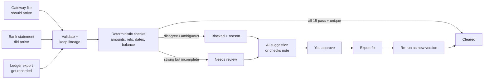
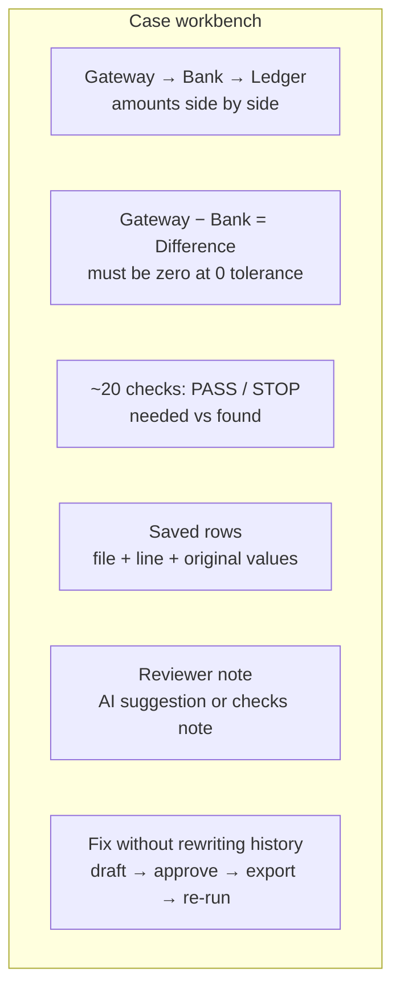
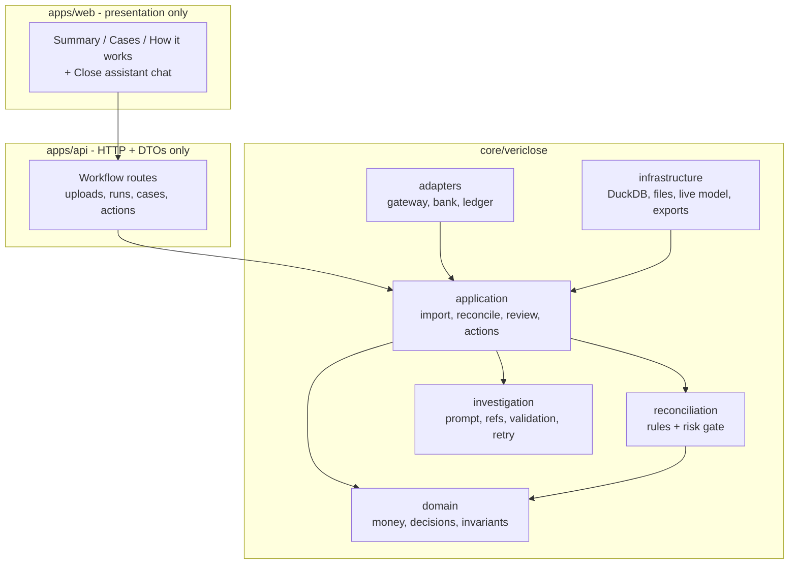
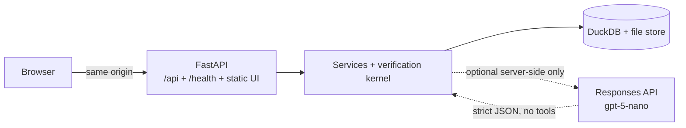
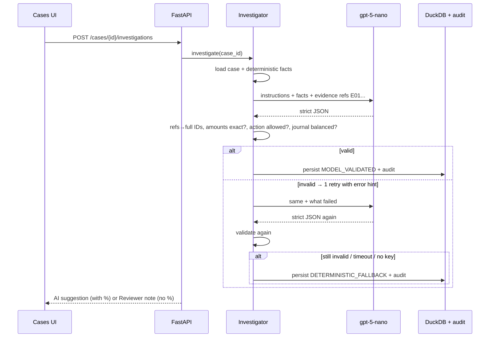

# VeriClose

**Evidence-first gateway → bank → ledger reconciliation. Synthetic data only.**

Upload three files. VeriClose either **clears** the case (every check passed), **asks you** to review it, or **blocks** it with the exact rows and reason. An optional AI helper explains cases in plain words — it can never clear one.

- Web: Summary → Cases → How it works, plus a persistent **Close assistant** chatbot
- API + web ship as one container; deterministic close works with **no model key**
- Every decision cites its source rows; corrections create new runs, never overwrite history

## Fastest judge path

```bash
make image
make smoke-container
make judge
```

Open <http://localhost:8000>, press **Load demo close**, then:

1. Summary → pick the **Blocked** row → opens its filtered cases
2. Open a `No bank receipt found` case → **Get AI suggestion**
3. Open a `Missing from the ledger` case → **Draft the fix** → approve → export → re-run

## Start locally

Prerequisites: Python 3.11, `uv`, Node.js 22+, `pnpm`, GNU Make.

```bash
make setup
make dev
```

- Web: <http://localhost:5173> (`/`, `/cases`, `/control-flow`)
- API docs: <http://localhost:8000/docs>
- Readiness: <http://localhost:8000/health/ready>
- Runtime config (no secrets): <http://localhost:8000/api/meta>

## Run checks

```bash
make verify
```

Runs Python lint, backend tests, frontend typecheck, and the production frontend build.

## The numbers to quote

These are the figures that make the demo credible. All come from config or a reproducible run — re-run to verify, don't memorize.

### Money safety (zero slack)

| Factor | Value | Where | What to say |
|---|---|---|---|
| Amount storage | Integer **paise**, never float | `core/vericlose/domain` | “₹1.00 is `100`. No rounding error exists.” |
| Amount tolerance | **0 paise** (settlement, bank, ledger) | `config/policies/razorpay_inr_v1.yaml` | “1 paise off blocks auto-clear.” |
| Direction | Explicit `DEBIT` / `CREDIT` + non-negative amount | domain invariants | “Sign is data, not a minus sign.” |
| Date window | Gateway → bank **0–3 days**, bank → ledger **≤3 days** | policy `dates` | “Day 4 is late, not missing — it waits or flags.” |
| Grouping bounds | ≤**12** candidates, group ≤**4** rows, ≤**2** valid groups | policy `grouping` | “Beyond that we abstain instead of guessing.” |
| Support score | **5000** amount + **2500** ref + **1500** date + **1000** narration = 10000 bps | policy `support_scoring_bps` | “Ranking only. 10000/10000 still can't clear.” |
| Auto-clear bar | All **15** required checks + unique match + policy allow | policy `auto_clear` | “Miss one, you're in the queue.” |

### Demo close (seed-42, reproducible)

```
315 source rows (193 gateway + 26 bank + 96 ledger lines)
→ 25 cases: 15 Cleared, 3 Looks OK, 2 Needs a call, 4 Blocked, 1 Bad data
→ 10 need a person; amount at stake ≈ ₹47,212.29 (uncleared only)
→ ~20 proof checks per case; each cites its file, line, and values
```

Reproduce: `make dev`, **Load demo close**, or programmatically reset via `POST /api/v1/demo/reset`.

### AI helper (advisory only)

| Factor | Value | Why it matters |
|---|---|---|
| Model | `gpt-5-nano` via OpenAI Responses API | Only model this key can call; small + fast |
| Token budget | `max_output_tokens: 5000` | `1200` failed: nano spends ~2500 reasoning tokens before writing, returns `incomplete` with no text |
| Reasoning | `effort: minimal` (~0–200 tokens, ~3–6s) | `medium` spent ~2500 tokens / ~19s and still mangled IDs |
| Timeout | **30s** then deterministic fallback | Reasoning models need headroom; 12s timed out |
| Evidence refs | Short `E01…` in prompt, mapped to full IDs server-side | Full 50-char IDs got truncated (`20260905` → `60905`) ~80% of the time |
| Output contract | Strict JSON schema: hypothesis, explanation, `evidence_ids`, `confidence_bps` 0–10000, one `recommended_action`, `requires_human_approval: true` | Anything else → rejected |
| Retry | **1** retry with the validation error fed back | Lifts live success from ~30% to ~70% without touching proof |
| Failure handling | `MODEL_UNAVAILABLE` / `MODEL_OUTPUT_INVALID` → plain-language checks note, **no `0%` shown** | Fallback keeps reason-specific guidance; proof unchanged |

Configure with `.env` (never commit it):

```dotenv
VERICLOSE_MODEL_API_KEY=your_key_here
VERICLOSE_MODEL_NAME=gpt-5-nano
VERICLOSE_MODEL_BASE_URL=https://api.openai.com/v1
VERICLOSE_MODEL_TIMEOUT_SECONDS=30
```

Without a key the footer reads `AI helper: off (checks still run)` and every investigation is a checks note. With a key it reads `AI helper: on (explains only)`.

### Upload and scope limits

`CSV/XLSX` only · `10 MB` per file · `INR` only · **one business** · corrected files become **new versions**.

## How it works



One case, one screen:



## Architecture (dependencies point inward)



Rules:

- `domain` imports nothing (no FastAPI, DB, parsing, UI, model SDK).
- `application` coordinates domain logic through ports.
- `adapters` absorb file-format differences.
- Concrete classes are wired only in `apps/api/app/composition.py`.
- Web never recomputes truth; it renders API responses.
- Runtime never imports `synthetic.truth` or evaluation labels.



## The model, precisely



What the model **may** do: explain in ≤3 short sentences, cite 1–4 refs, suggest exactly one next step, draft journal lines only for `JOURNAL_EXPORT` (≥2 lines, debits = credits).

What it **cannot** do: change proof level, auto-clear, edit sources, post journals, touch the filesystem, message anyone, or invent rows/amounts. Narration and cell text are sent as `UNTRUSTED_SOURCE_DATA`, never instructions.

## Where it can fail (and what you see)

| Failure | Trigger | System response | What to demo |
|---|---|---|---|
| Bad file | Wrong columns, bad dates, unbalanced journal | Row-exact error: file, line, field, value, fix | Upload a broken CSV |
| No unique match | 2 bank rows fit one settlement | `Two bank rows could fit` — abstains | `BANK_RECEIPT_AMBIGUOUS` case |
| Amount off by paise | Gateway ≠ bank at 0 tolerance | `Bank paid a different amount`, variance shown | `BANK_AMOUNT_MISMATCH` case |
| Missing side | No bank row / no ledger entry | `No bank receipt found` / `Missing from the ledger` | `MISSING_*` cases |
| Reference wrong | Amount+date fit, UTR doesn't | `Reference doesn't prove the link` | `REFERENCE_MISMATCH` case |
| Duplicate | Same UTR or ledger entry twice | Critical, needs dedupe | `DUPLICATE_*` cases |
| Date outside window | Day 4+ | `Paid outside the window` → wait/reassign | `BANK_DATE_OUT_OF_RANGE` |
| Model timeout/offline | >30s or no network | Checks note, “AI didn't return in time” | Pull network / remove key |
| Model invents ref/amount | Wrong `E07` or paise | Rejected → 1 retry → checks note if still bad | Happens ~3/10 live; UI stays calm |
| No key configured | `.env` absent | `AI helper: off`, all notes from checks | `make judge` without key |
| Double submit | Approve/export twice | Idempotency key + receipt, no duplicate | Click export twice |
| Oversize upload | >10 MB or non-CSV/XLSX | Rejected before parsing | Try a big file |

Operational numbers (rows, cases, at-stake ₹) live in the Summary page. Benchmark accuracy (precision/recall/false-clears) is **never** shown there — run `make benchmark` for the multi-seed harness; results go to `evaluation/reports/`, not the UI.

## Product loop and safety boundary

```text
gateway + bank + ledger
  → validate and preserve lineage
  → deterministic proof or honest abstention
  → cases + helper suggestion (advisory)
  → your approval
  → checksummed export or clarification
  → corrected version + re-run as new run
```

- Deterministic code owns money, matching, proof, balance, and auto-clear.
- Model output is schema-validated against supplied refs/amounts.
- Every export needs your approval and returns an idempotency receipt.
- Corrections are new versions; old evidence and decisions stay visible.

## Reproducible evidence

```bash
make benchmark
make examples
```

Run `make benchmark` for the multi-seed safety gate (event/case accuracy, scenario diagnostics, p50/p95, exception recall, false-clear enforcement). Results land in `evaluation/reports/benchmark-latest.{json,md}` — read numbers there, they are not pasted here.

Fresh artifact examples: [docs/examples](docs/examples) (close report, exception pack, audit log, approved journal, smoke result, browser checklist + `manifest.json` hashes).

## Generate, import, reconcile (CLI)

```bash
make generate
make import-batch RUN_ID=demo-seed-42-v1
make generate
make reconcile CLOSE_RUN_ID=demo-close-v1
```

`import-batch` prints detected profile, rows seen/normalized/quarantined, validation codes, canonical event count, run state. `reconcile` prints throughput, proof-level counts, amount at risk, stage timings, exception-file path. Operational output — not benchmark accuracy (Segment 5 isolates that).

Your own synthetic files:

```bash
uv run python -m scripts.import_batch \
  --gateway path/to/gateway.xlsx \
  --bank path/to/bank.csv \
  --erp path/to/erp_gl.xlsx
```

Generator writes `.data/synthetic/seed-42/` (`inputs/`, `manifest.json`, `private/ground_truth.json` — only evaluation may read the last).

Manufacturing packs: [`demo/manufacturing`](demo/manufacturing), regenerate with `make manufacturing-demos`.

## Judge-local container

```bash
make image
make judge
```

Open <http://localhost:8000>. Deterministic close works with no key; pass `VERICLOSE_MODEL_API_KEY` only via environment for the advisory path.

Same image holds the import + close CLIs; mount generated inputs under `/app/data` for `python -m scripts.import_batch` / `python -m scripts.reconcile`. Or fully ephemeral:

```bash
docker run --rm -v /app/data vericlose:dev \
  python -m scripts.reconcile --generate-demo \
  --run-id judge-seed-42 --data-dir /app/data \
  --database /app/data/vericlose.duckdb \
  --exceptions-output /app/data/exceptions.json
```

`docker compose up --build` also works.

## Code map

- `apps/api`: HTTP delivery + production static serving
- `apps/web`: React UI (Summary / Cases / How it works + assistant)
- `core/vericlose`: domain, ports, rules, workflows
- `synthetic`: seeded generators (runtime never reads truth)
- `evaluation`: hidden-truth benchmark + practitioner review
- `config`: versioned mappings + `razorpay_inr_v1` policy
- `tests`: unit, integration, contract, adversarial, deployment

Docs: [DEPLOYMENT.md](DEPLOYMENT.md) (judge runbook), [demo and submission guide](docs/DEMO_AND_SUBMISSION_GUIDE.md) (pitch + key setup), [docs/PRODUCT_WORKFLOW.md](docs/PRODUCT_WORKFLOW.md) (plain-language journey), [docs/FUTURE_OPPORTUNITIES.md](docs/FUTURE_OPPORTUNITIES.md) (out of MVP). Architecture decisions live in [docs/adr](docs/adr); accounting rules and vocabulary in [docs/domain](docs/domain).

## Data safety

Synthetic data only. No real client data, credentials, or proprietary mappings. Never commit `.env`, local databases, uploads, or truth reports. Hosted demo always shows **“Synthetic data only.”**
